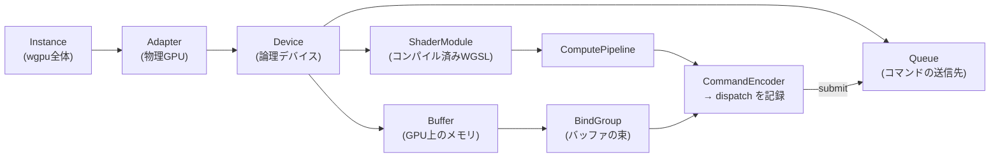

この章でわかること:

- RustからGPUを使う選択肢の全体像(wgpu、CUDA、rust-gpuなど)
- WebGPUの構成要素: Device、Queue、バッファ、バインドグループ、パイプライン
- WGSLでのコンピュートシェーダの書き方
- ベクトル加算を最初から最後まで動かすコードと、その実測結果
- 小さな処理をGPUで実行しても速くならないことの実測

この章のコードは、リポジトリの`examples/ch11-vector-add`に
完全な形で入っています。GPUはブラウザのRust Playgroundからは
使えないため、この章と次章は手元での実行が前提です。

```sh
cd examples
cargo run --release -p ch11-vector-add
```

## RustからGPUを使うための選択肢

2026年時点の主な選択肢を挙げます。

- **wgpu**: ブラウザ標準のGPU APIである**WebGPU**
  ([W3C仕様](https://www.w3.org/TR/webgpu/))のRust実装で、
  実行時にMetal(macOS)、Vulkan(Linux/Android)、DirectX 12(Windows)へ
  振り分けます。特定ベンダーに依存しない汎用GPU計算の
  標準的な選択肢で、本書はこれを使います
- **CUDA系**(cudarcクレートなど): NVIDIA GPU専用です。性能の上限と
  ライブラリ群(cuBLASなど)は最も充実していますが、
  ハードウェアもツールチェーンもNVIDIAに固定されます
- **rust-gpu**: シェーダ自体をRustで書いてSPIR-Vにコンパイルする
  プロジェクトです。本書では標準のシェーダ言語(WGSL)を使います
- **burn / candle**: 機械学習フレームワークです。内部でwgpuやCUDAを
  使います。行列演算だけが目的なら、自分でシェーダを書くより
  これらのライブラリを使うほうが速く、確実です

## WebGPUの構成要素

wgpuのAPIはグラフィックスAPIを基にしているため、構成要素が
多くあります。次の図に構成要素の関係を示します。



- **Instance** → **Adapter** → **Device**の順にたどって
  GPUへの接続を確立します。Deviceがリソースを作成し、
  **Queue**がコマンドを受け付けます
- **Buffer**はGPU側のメモリです。**BindGroup**は、シェーダの
  どの番号にどのバッファを対応付けるかを表す対応表です
- **ComputePipeline**は、特定のシェーダの特定の関数を実行可能な
  状態にしたものです。**CommandEncoder**はGPUへのコマンドを記録します

## WGSLでシェーダを書く

GPU上で実行されるプログラム(**シェーダ**、shader)は、WebGPUでは
**WGSL**(WebGPU Shading Language)という専用言語で書きます。
次がベクトル加算のシェーダの全文です。

```wgsl
// add.wgsl: c[i] = a[i] + b[i]

@group(0) @binding(0)
var<storage, read> a: array<f32>;

@group(0) @binding(1)
var<storage, read> b: array<f32>;

@group(0) @binding(2)
var<storage, read_write> c: array<f32>;

@compute @workgroup_size(64)
fn add(@builtin(global_invocation_id) gid: vec3<u32>) {
    let i = gid.x;
    // 要素数が64の倍数でない場合、はみ出したスレッドは何もしない
    if (i >= arrayLength(&a)) {
        return;
    }
    c[i] = a[i] + b[i];
}
```

読み方のポイントは3つです。

- `var<storage, ...>`はVRAM上のバッファです。`@group`と`@binding`の
  番号で、Rust側のバインドグループと対応付けます
- `add`関数は**要素1つにつき1回**、並列に呼び出されます。
  自分が何番目の呼び出しかは`global_invocation_id`でわかります。
  「ループを書かず、ループの中身だけを書く」のがシェーダの書き方です
- `@workgroup_size(64)`は、64スレッドを1つのワークグループ(9章)に
  束ねる宣言です。起動時には「ワークグループをいくつ起動するか」を
  指定するので、総スレッド数は 64 × グループ数になります

9章のSIMTを思い出してください。この「1要素1スレッド」の
スカラなコードが、ハードウェア上ではワープ単位のベクトル命令として
実行されます。隣のスレッド(`i`と`i+1`)が隣の要素を読むので、
アクセスはコアレッシング(10章)されます。

## Rust側のコード: 接続から読み出しまで

Rust側のコードは長いので、要点を段階ごとに抜粋します
(全文は`examples/ch11-vector-add/src/main.rs`にあります)。

**1. GPUに接続します。** wgpuの非同期APIは、計算用途なら
`pollster`で同期的に待って問題ありません。

```rust
let instance = wgpu::Instance::new(wgpu::InstanceDescriptor::new_without_display_handle());
let adapter = pollster::block_on(instance.request_adapter(&Default::default()))
    .expect("GPUが見つかりません");
let (device, queue) = pollster::block_on(adapter.request_device(&wgpu::DeviceDescriptor {
    // 既定値でよい項目は省略(全文はリポジトリ参照)
    ..
}))?;
```

**2. シェーダをコンパイルし、バッファを作ります。** 入力は
`bytemuck`クレートで`&[f32]`をバイト列に変換して書き込みます。
用途は`usage`フラグで宣言します。

```rust
let module = device.create_shader_module(wgpu::include_wgsl!("add.wgsl"));

let buf_a = device.create_buffer_init(&wgpu::util::BufferInitDescriptor {
    label: Some("a"),
    contents: bytemuck::cast_slice(&a),
    usage: wgpu::BufferUsages::STORAGE,
});
// b も同様。出力 c は STORAGE | COPY_SRC、
// CPUに読み戻す用の buf_read は COPY_DST | MAP_READ で作る
```

CPUが直接読めるバッファ(`MAP_READ`)と、シェーダが読み書きする
バッファ(`STORAGE`)が別々になっている点に注目してください。
10章の「CPUとGPUの間の転送はボトルネックになる」という事情が、
APIの形にそのまま現れています。

**3. バインドグループとパイプラインを作ります。**
シェーダの`@binding`番号にバッファを対応付け、
エントリポイント`add`を指定してパイプラインにします。

```rust
// レイアウト = 「binding 0,1は読み取り専用、2は書き込み可」という型宣言
// (定型が長いので全文はリポジトリ参照)
let bgl = device.create_bind_group_layout(/* 各bindingの種類の宣言 */);

// バインドグループ = レイアウトに実際のバッファを当てはめたもの
let bind_group = device.create_bind_group(&wgpu::BindGroupDescriptor {
    layout: &bgl,
    entries: &[
        wgpu::BindGroupEntry { binding: 0, resource: buf_a.as_entire_binding() },
        wgpu::BindGroupEntry { binding: 1, resource: buf_b.as_entire_binding() },
        wgpu::BindGroupEntry { binding: 2, resource: buf_c.as_entire_binding() },
    ],
    label: None,
});

// パイプライン = シェーダモジュール + レイアウト + エントリポイント
let pipeline = device.create_compute_pipeline(&wgpu::ComputePipelineDescriptor {
    module: &module,
    entry_point: Some("add"),
    /* layout などは全文参照 */
    ..
});
```

これで、次の手順で使う`bind_group`と`pipeline`が揃いました。

**4. コマンドを記録して送信します。** 100万要素をワークグループ
サイズ64で割った個数のグループを起動します。

```rust
let mut encoder = device.create_command_encoder(&Default::default());
{
    let mut pass = encoder.begin_compute_pass(&Default::default());
    pass.set_pipeline(&pipeline);
    pass.set_bind_group(0, &bind_group, &[]);
    pass.dispatch_workgroups(n.div_ceil(64) as u32, 1, 1); // 15625グループ
}
encoder.copy_buffer_to_buffer(&buf_c, 0, &buf_read, 0, buf_c.size());
queue.submit([encoder.finish()]);
```

`submit`の時点で初めて、記録した一連のコマンド(計算→結果のコピー)が
まとめて送られ、非同期に実行されます。それまでGPUでは何も起きません。

**5. 結果を読み出します。** 読み戻しバッファをマップ(CPUから見える
状態に)し、GPUの完了を待ってからバイト列を`Vec<f32>`に戻します。

```rust
let slice = buf_read.slice(..);
slice.map_async(wgpu::MapMode::Read, |_| {});
device.poll(wgpu::PollType::wait_indefinitely())?;
let data = slice.get_mapped_range()?;
let c: Vec<f32> = bytemuck::allocation::pod_collect_to_vec(&data);
```

足し算1回のために100行を超える準備が必要です。
ただし、この準備は何を計算しても同じ形なので、実務では一度
ヘルパー関数にまとめれば済みます。「バッファを作り、対応付け、
記録して、送信し、読み戻す」という手順の構造を覚えてください。

## 実行結果: CPUより遅い

筆者のMac(Apple M4)での実行結果です。

```text
GPU: Apple M4
GPU実行+読み出し: 6.757292ms
CPU(1コア)      : 434.166µs
検証: OK (c[10] = 30)
```

GPUはCPUの1コアより**15倍遅い**結果でした。

前章までの知識で、この結果は説明がつきます。ベクトル加算の
算術強度は約0.08 FLOP/byteで、完全なメモリ帯域律速です。
GPUの数千の演算ユニットはほとんど使われません。さらに、
この「GPU実行+読み出し」の時間には、コマンドの記録・送信、
完了待ち、バッファのマップといったAPIの往復(ミリ秒級)が
含まれており、カーネルの計算時間そのもの(マイクロ秒級)は
その中では無視できる大きさです。ユニファイドメモリのM4でも
この結果なので、PCIe接続の構成では、これにデータ転送の時間が
さらに加わります。

この結果が示すとおり、GPUがCPUを上回るには、転送とAPIのオーバーヘッドを
差し引いてもなお上回るだけの計算量(高い算術強度と大きな規模)が必要であり、
処理をGPUに移すだけでは速くなりません。
次章で、その分岐点を実測します。

:::note[このコードがブラウザで動かない理由と、WebAssemblyでの実行]
本書のインタラクティブ実行はRust Playgroundのサーバ上で
動くため、GPUがなくwgpuの例は実行できません。一方、wgpu自体は
WebAssemblyにコンパイルしてブラウザの**WebGPU** APIで動かせます。
同じRustコードがネイティブでもブラウザでも動くことが、
WebGPU標準の主要な目的の1つです。Webアプリケーション開発者に
とっては、そちらが中心的な使い方になる可能性があります。
:::

## まとめ

- RustからのGPU計算はwgpuが標準的な選択です。Metal/Vulkan/DX12の
  違いを抽象化し、シェーダはWGSLで書きます
- シェーダは「ループの中身だけを書く」形式です。1要素1スレッドで
  並列実行され、隣接スレッドの隣接アクセスがコアレッシングされます
- Rust側は、バッファ作成、バインド、パイプライン作成、記録、送信、
  読み戻しという定型の手順です
- 100万要素のベクトル加算は、GPUのほうがCPUより15倍遅い結果でした。
  算術強度の低い小規模な処理はGPUに向きません

次章は基礎編の最終章です。算術強度の高い問題である行列積を
CPUとGPUの両方で段階的に最適化し、基礎編で学んだ知識を使って
「どちらをいつ使うか」の判断基準を示します。
