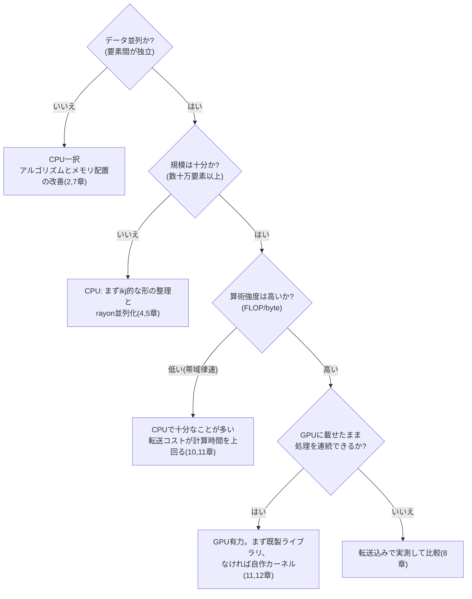

この章でわかること:

- 同じ行列積が、書き方だけで77倍変わる過程(実測)
- CPU側の最適化: ループ順の入れ替えと並列化
- GPU側の最適化: 素朴なカーネルから算術強度を上げるまで
- 「CPUとGPUのどちらを使うか」の判断基準

この章の実験はリポジトリの`examples/ch12-matmul`で、
すべて手元で再現できます。

```sh
cd examples
cargo run --release -p ch12-matmul        # n=1024
cargo run --release -p ch12-matmul -- 2048
```

計測環境は筆者のMac(Apple M4、CPU 10コア、GPU 10コア、
ユニファイドメモリ)です。倍率はハードウェアで変わりますが、
何がなぜ効果を持つかという構造は共通です。

## 題材: 行列積

n×n行列の積 C = A × B を`f32`で計算します。
定義どおりに書くと、次のコードになります。

```rust
/// 素朴な3重ループ(ijk順)
fn matmul_naive(a: &[f32], b: &[f32], c: &mut [f32], n: usize) {
    for i in 0..n {
        for j in 0..n {
            let mut sum = 0.0;
            for k in 0..n {
                sum += a[i * n + k] * b[k * n + j];
            }
            c[i * n + j] = sum;
        }
    }
}
```

演算数は2n³で、n=1024では約21億回の浮動小数点演算です。
データは行列3つで12MBです。演算の回数がデータ量に対して
非常に多い、算術強度の高い問題(10章)です。このため、
行列積は機械学習の中心的な演算であり、最適化の古典的な題材でもあります。

n=1024の実測値は**873ミリ秒**(2.5 GFLOP/s)です。この値を基準にします。

## CPU編 その1: ループの順序を変えるだけで13倍

素朴版の問題は、最内ループの`b[k * n + j]`です。
`k`が増えるたびにアドレスが n×4バイト(4KB)ずつ進みます。
毎回別のキャッシュラインにアクセスし、プリフェッチも
効果を持ちにくい、2章で見た最悪のアクセスパターンです。

ループの入れ子の順序を ijk から **ikj** に入れ替えます。

```rust
/// ループ順を ikj に。すべてのアクセスが行方向(連続)になる
fn matmul_ikj(a: &[f32], b: &[f32], c: &mut [f32], n: usize) {
    c.fill(0.0);
    for i in 0..n {
        for k in 0..n {
            let aik = a[i * n + k];
            let b_row = &b[k * n..k * n + n];
            let c_row = &mut c[i * n..i * n + n];
            for j in 0..n {
                c_row[j] += aik * b_row[j];
            }
        }
    }
}
```

計算の内容も回数もまったく同じです。しかし最内ループは
「連続した`b`の行を読み、連続した`c`の行に加算する」形になりました。
キャッシュラインの全バイトが使われ(2章)、
依存のない連続アクセスなので自動ベクトル化も適用されます(4章)。

実測値は**67ミリ秒**(32 GFLOP/s)で、13倍速くなりました。
アルゴリズムを変えず、メモリアクセスの順序を変えただけです。
この結果が、本書で最も強調したい点です。

## CPU編 その2: 並列化でさらに4.4倍

ikj版は行ごとに独立した計算なので、rayon(5章)で
行単位に並列化できます。`c.par_chunks_mut(n)`で`c`を行に分割し、
各スレッドが自分の行だけを書きます(データ競合はコンパイル時に
排除されます)。

実測値は**16.2ミリ秒**(132 GFLOP/s)で、10コアで約4倍です。
コア数どおりの10倍にならないのは、メモリ帯域の共有(5章の
スケーリング限界)に加え、コアの性能が均一でないためです
(Apple SiliconのCPUは高性能なPコアと省電力なEコアの混成です)。

素朴版と比べて54倍です。CPU側の最適化はここまでにします
(さらにキャッシュブロッキングや明示的SIMDを重ねる余地はあります)。

## GPU編 その1: 素朴なカーネル

同じ計算をGPUで実行します。1スレッドがCの1要素を計算する、
最も素朴なWGSLカーネルです(構造は11章と同じです)。

```wgsl
@compute @workgroup_size(16, 16)
fn matmul_naive(@builtin(global_invocation_id) gid: vec3<u32>) {
    let n = params.n;
    let row = gid.y;
    let col = gid.x;
    if (row >= n || col >= n) { return; }
    var sum = 0.0;
    for (var k = 0u; k < n; k = k + 1u) {
        sum = sum + a[row * n + k] * b[k * n + col];
    }
    c[row * n + col] = sum;
}
```

100万スレッドを起動します。実測値(計算のみ、転送を除く)は
**14.4ミリ秒**(149 GFLOP/s)で、最初の版でCPUの全コア版と
同水準です。9章で説明した大規模並列の効果が表れています。

## GPU編 その2: 共有メモリのタイル化

GPU最適化の定番は、10章で説明した共有メモリの活用です。
ワークグループ(16×16)でAとBのタイルを共有メモリにコピーし、
バリアで同期しながら繰り返し読みます。

```wgsl
var<workgroup> tile_a: array<f32, 256>;
var<workgroup> tile_b: array<f32, 256>;
// 各スレッドがタイルの1要素をコピーする → workgroupBarrier() →
// タイル内16要素分の積和を共有メモリから読む → 次のタイルへ
```

実測値は**15.9ミリ秒**(135 GFLOP/s)で、速くなりませんでした。

教科書どおりなら効果があるはずの手法に効果がありませんでした。
考えられる理由は、このハードウェアとカーネルの組み合わせにあります。
M4はユニファイドメモリと比較的大きなキャッシュを持ち、素朴版の時点で
(コアレッシングされた`b`の読み出しと、キャッシュに保持された`a`の行に
よって)メモリ転送は飽和していないと考えられます。そうであれば、
ボトルネックは**1回の積和に対して2回のロード命令を発行しているという
命令数の比率**にあり、メモリ帯域ではありません。カーネル内部を計測して
いないため、これは仮説ですが、次の実験の結果がこの仮説と整合します。
いずれにせよ、ボトルネックでない箇所を改善しても速くならない
(8章)のはGPUでも同じです。なお、キャッシュの小さい
外付けGPUでは、同じタイル化が明確な効果を持つのが一般的です。
最適化はハードウェアに依存します。

## GPU編 その3: 1スレッドあたりの演算比率を上げる

ボトルネックが「ロードあたりの演算数」なら、対策は
1スレッドにより多くの計算を割り当てることです。
1スレッドがCの**4×4ブロック**を計算するカーネルに変えます。

```wgsl
@compute @workgroup_size(8, 8)
fn matmul_blocked(@builtin(global_invocation_id) gid: vec3<u32>) {
    // 4×4個の積算値をレジスタに保持
    var acc: array<vec4<f32>, 4>;
    for (var k = 0u; k < n; k = k + 1u) {
        let vb = /* bの行から4要素 */;        // 4ロード
        for (var i = 0u; i < 4u; i = i + 1u) {
            let aik = a[(row0 + i) * n + k];  // 4ロード
            acc[i] = acc[i] + aik * vb;       // 16積和
        }
    }
    // acc を c に書き出す
}
```

1反復あたりメモリ参照8回に対して積和16回で、素朴版(参照2回に
積和1回)と比べて、演算対ロードの比率が4倍になりました。
実測値は**11.3ミリ秒**(190 GFLOP/s)で、今度は効果がありました。
10章のルーフラインの考え方(何が律速かを見極めてから対策する)が、
GPUカーネルの内部でもそのまま通用することがわかります。

なお、実用レベルの行列積カーネル(ベンダーのライブラリや専用実装)は、
タイル化・ブロック化・ベクトルロードを何段も重ねて、
このGPUなら数TFLOP/sまで到達します。この章の自作カーネルは、
その最初の段階にあたります。行列積だけが目的なら、
ライブラリ(Metal Performance Shaders、cuBLASなど)を使うのが適切です。

## 結果一覧

n=1024(計算のみ)の全記録です。

| 実装 | 時間 | GFLOP/s | 素朴版比 |
| --- | --- | --- | --- |
| CPU 素朴(ijk) | 873 ms | 2.5 | 1x |
| CPU ikj | 67 ms | 32 | 13x |
| CPU ikj + rayon(10コア) | 16.2 ms | 132 | 54x |
| GPU 素朴 | 14.4 ms | 149 | 61x |
| GPU タイル化 | 15.9 ms | 135 | 55x |
| GPU ブロック化 | 11.3 ms | 190 | **77x** |

n=2048でも傾向は同じです(CPU並列117ms、GPUブロック化89ms)。
重要な注記が3つあります。

- GPUの数字に**初期化と転送を含めると**、n=1024のブロック化は
  約15ミリ秒になり、CPU並列版とほぼ同じになります。単発の計算では、
  GPUの優位はなくなります
- この小さな差は、ユニファイドメモリのMacでの結果です。
  演算性能の高い外付けGPUなら計算自体が1桁速くなる一方、
  PCIe転送のコストも1桁大きくなります。**構成によって結論は変わります**
- 計測の条件には非対称な点があります。GPUの時間は
  「ディスパッチ+完了待ち」の壁時計時間でカーネル単体より長めに出ますし、
  CPU側は各1回の計測です。厳密な比較にはGPU側のタイムスタンプ計測や
  複数回の統計(8章)が必要ですが、本書の目的は傾向の把握です

## 使い分けの判断

基礎編の内容を1つの図にまとめると、判断は次の流れになります。



どの分岐でも変わらない原則が3つあります。

1. **比較は最適化したCPUと行います。** 素朴なCPUコードとGPUを
   比べると77倍、最適化したCPUと比べると1.4倍でした。
   「GPUで100倍」という数字を見たら、CPU側でループ順の改善すら
   行われていない可能性を疑ってください
2. **速さを決める要因はどちらも同じです。** 連続したメモリアクセス、
   高い並列度、揃った分岐、高い算術強度の4つです。CPUで学んだことは
   すべてGPUで通用し、その逆も同様です
3. **最終的な判断は計測で行います。** この章の「タイル化に効果がない」
   のような予想外の結果は、実測でしか見つかりません

## まとめ

この章のまとめは、そのまま基礎編全体のまとめです。
12章分を通じて一貫して見てきたことを3点にまとめます。

- 現代の計算の速さは、演算そのものではなく
  **メモリアクセスの形と並列度**でほぼ決まります
- Rustは、ゼロコスト抽象化と安全な並列性によって、
  この2つを両立して追求できる言語です
- 直感は誤ることがあります。**アセンブリと計測**という2つの手段で、
  実際に何が起きているかを確かめてください

基礎編はここまでです。ここまで読んだ読者は、
「なぜこのコードは速いのか」を仕組みで説明できるはずです。
用語の確認には[用語集](/appendix/glossary/)を使ってください。

この先には応用編(Part IV〜VII)が続きます。数の表現、仮想メモリ、
キャッシュの内部構造、アロケータ、async、GPUカーネルの技法といった、
基礎編で意図的に省いた主題を、同じ方法(実測と機構の説明)で
1つずつ扱います。
[13章 数の表現](/cpu-deep/13-numbers/)から読み進めてください。
