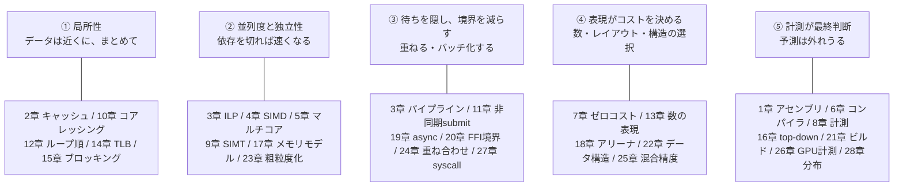

この章でわかること:

- レイテンシを分布で扱う方法: 平均と中央値と最悪値は異なる量
  (実測: 中央値70ナノ秒、最大33ミリ秒)
- 計測結果を実際より良く見せる協調的省略(coordinated omission)という誤り
- 性能の回帰を防ぐ運用: ベンチマークのCI化と安定化
- 本書全体の知識の全体像: 28章に共通する5つの原則
- なぜ体系に必須か: 知識は運用されて初めて性能になります。
  個人の技能を、チームと時間に耐える仕組みへ変換するのが最終章です

## レイテンシは分布で扱う

Webアプリケーションの性能は、ほとんどの場合**レイテンシ**
([2章](/cpu/02-memory-hierarchy/)で導入した言葉の、
サービス応答時間への適用)で評価されます。最初に改めるべき習慣は、
平均だけで評価することです。

実験します。`HashMap`への100万件の挿入を、**1回ずつ個別に**
計測して分布を見ます。

<RustPlay snippet="ch28/latency" mode="release" title="100万回のinsertの、1回ごとの時間" />

筆者の実測(Playground)です。

```text
平均   :      152 ns
中央値 :       70 ns
p99    :      260 ns
p99.9  :      470 ns
最大   : 33340370 ns  (33.3ミリ秒)
```

中央値は70ナノ秒ですが、最大値は**33ミリ秒**で、中央値の47万倍です。
原因は[22章](/rust-deep/22-data-structures/)で
学んだリハッシュ(表の作り直し)です。償却すれば安い
([7章](/rust-opt/07-zero-cost/))操作は、**分布の裾を厚くします**。
平均152ナノ秒という数字は、この最大値の存在を隠しています。

そのため実務では**パーセンタイル**(percentile)で評価します。
p50(中央値)、p99(100回に1回の遅さ)、p99.9などを使います。
1回の操作の内部でm個のリクエストが実行されるなら、いずれかが
p99以上の遅さになる確率は1−0.99^mです。m=50で約4割、
数百なら大半のユーザーが毎回その遅さを経験します。
ファンアウトの大きな現代のシステムでSLO(サービスレベル目標)が
p99系で書かれるのはこのためです。

:::note[協調的省略: 計測が遅さを隠す誤り]
負荷試験ツールで「リクエストを送り、応答を待って、次を送る」
方式を使うと、サーバが33ミリ秒停止している間、ツールは
**次のリクエストを送らずに待ちます**。停止期間に
本来発生したはずの数百件の遅い応答が記録から消え、
p99は実際より大幅に良く見えます。これを**協調的省略**
(coordinated omission)と呼びます。対策は「予定時刻を基準に」
送り続ける負荷生成(一定レートを保つ)と、それを前提に設計された
計測ツール(HdrHistogram系)を使うことです。
:::

## ばらつきの源泉: 本書の総復習

「たまに遅い」現象の原因の特定は、本書で学んだ機構の総復習になります。
p99の異常を見たら、この一覧を上から疑ってください。

| 源泉 | 章 |
| --- | --- |
| リハッシュ・`Vec`の再確保 | [7章](/rust-opt/07-zero-cost/)・[22章](/rust-deep/22-data-structures/) |
| 大きな構造の`drop`(解放の連鎖) | [18章](/rust-deep/18-allocators/) |
| アロケータの遅い経路・断片化 | [18章](/rust-deep/18-allocators/) |
| ページフォールト(初回タッチ、起動直後) | [14章](/cpu-deep/14-virtual-memory/) |
| asyncランタイムのブロッキング混入 | [19章](/rust-deep/19-async/) |
| ロック競合・false sharing | [5章](/cpu/05-multicore/)・[17章](/cpu-deep/17-memory-model/) |
| CPU周波数の変動・サーマルスロットリング | [21章](/rust-deep/21-build-control/)・[26章](/gpu-deep/26-gpu-timing/) |
| キャッシュ・TLBの内容の消失(コンテキストスイッチ後) | [27章](/systems/27-os-layer/) |

クラウド環境ではさらに2つの源泉が加わります。1つは、多くのインスタンスで
**vCPUがSMTの論理コア**([5章](/cpu/05-multicore/))であり、
物理コア換算で半分の性能しかない場合があることです(インスタンス
仕様の確認が必要です)。もう1つは**ノイジーネイバー**(noisy neighbor)で、
同じ物理ホストの他のテナントとキャッシュやメモリ帯域
([2章](/cpu/02-memory-hierarchy/))を共有するため、
同じコードの性能が日によって変わることです。
本書のPlayground実測のばらつきも、この現象によるものです。

## 性能の回帰を防ぐ: ベンチマークの運用

性能は、機能と同じように**回帰**します。一見無害なリファクタリングが
インライン化([6章](/rust-opt/06-compiler/))を妨げ、依存関係の更新が
アロケーションを増やします。対策も機能と同じで、**継続的に検査します**。

- **ベンチマークをCIに組み込む**: criterion([8章](/rust-opt/08-measure/))は
  基準値との比較(`--save-baseline`)の機能を持ち、
  [critcmp](https://github.com/BurntSushi/critcmp)で差分を確認できます
- **時間ではなく命令数で測る**: 共有CIランナーの時間計測は
  ばらつきが大きすぎます(上の表のとおりです)。
  [iai-callgrind](https://github.com/iai-callgrind/iai-callgrind)は
  実行命令数・キャッシュミス数([8章](/rust-opt/08-measure/)の
  カウンタのシミュレーション版)で測るため、共有環境でも安定して
  回帰を検出できます。速さではなく処理量の定点観測です
- **閾値は緩く、傾向は厳しく設定する**: 例えば「1回の5%は雑音として扱い、
  数回連続の3%は回帰として調べる」といった運用にします
  (数字は環境のばらつきに合わせて決めます)
- **プロファイルを定期的に確認する**: 月に一度フレームグラフ(8章)を
  確認するだけで、気づかないうちに増えた処理を早期に発見できます

そして組織の規則として、**性能の主張には数字を付けます**。
「速くなったはず」というプルリクエストには、8章の手順
(計測→変更→再計測)の出力を添付します。本書が全章で行ってきた
「筆者の実測では」を、チームの習慣にすることです。

## 知識の全体像

最後に、基礎編・応用編の28章に共通する5つの原則を整理します。
次の図が本書全体の対応関係です(主要な対応のみ示します)。



- **① 局所性**: キャッシュ、TLB、コアレッシングに関わる原則です。
  速いメモリは小さいので、使うデータを近くに置きます。本書で最も多くの倍率
  (92倍、70倍、13倍など)を生んだ原則です
- **② 並列度と独立性**: ILPからSIMD、マルチコア、GPUまで、
  現代の計算能力はすべて並列性に基づきます。並列性を引き出す条件は
  常に、依存を取り除くことでした
- **③ 待ちを隠し、境界を減らす**: パイプライン、async、
  GPUの重ね合わせ、syscallのバッチ化が該当します。待ちは消せなくても
  重ねられ、境界は越える回数を減らせます
- **④ 表現がコストを決める**: 同じ意味でも、数の形式・メモリの
  レイアウト・データ構造の選択で性能は桁単位で変わります。
  抽象化は無料でも、表現は無料ではありません
- **⑤ 計測が最終判断**: ①〜④の適用が正しかったかは
  計測だけで確認できます。本書の実験でも、定石が覆った場面
  (23章、21章のPGO)が何度もありました

この5つは、CPUにもGPUにもOSにも、そして今後現れる新しい
ハードウェアにも適用できます。個別の数値(キャッシュのサイズ、
ワープの幅)は世代で変わりますが、原則と、それを検証する方法は
変わりません。

## まとめ

- レイテンシは分布で扱います。平均152nsの裏に33msの最大値が
  ありました(実測)。p99系のパーセンタイルとSLOが実務の指標です
- 負荷試験では協調的省略に注意します。応答を待ってから次を送る
  計測は、最悪の期間を記録から除外してしまいます
- 「たまに遅い」原因の一覧(リハッシュ、drop、ページフォールト、
  ブロッキング混入、周波数、ノイジーネイバー)は本書の各章の索引でもあります
- 性能はテストと同じく回帰します。ベンチマークのCI化(criterion/
  iai-callgrind)と、性能の主張に数字を添える習慣が対策です
- 全28章は5つの原則(局所性、並列度、待ちと境界、表現、計測)に
  整理できます。個別の数値は世代で変わっても、原則は変わりません

## 読み終えた読者へ

本書のすべての実測は、リポジトリの`src/snippets/`と`examples/`で
再現できます。読者自身の環境で数字がどう変わるかを確認することが、
原則⑤の実践であり、この本の最も重要な課題です。
さらに学ぶには[さらに学ぶには](/appendix/resources/)を、
用語の確認には[用語集](/appendix/glossary/)を参照してください。

計測に基づいた設計を続けてください。
