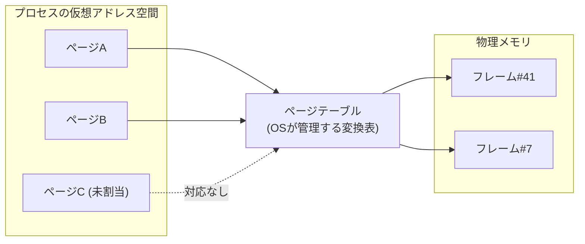

import RustPlay from '@components/RustPlay.astro';
import tlb from '@snippets/ch14/tlb.rs?raw';
import fault from '@snippets/ch14/fault.rs?raw';

この章でわかること:

- プログラムが見るアドレスが「仮想」であること。ページテーブルによる変換の仕組み
- TLB — アドレス変換のキャッシュと、そのミスのコスト(実測で1.9倍)
- 「メモリを確保する」と「物理メモリを使う」が別物であること
  (デマンドページング。実測で初回アクセスは220倍遅い)
- hugepages、コピーオンライト、mmapの位置づけ
- なぜ体系に必須か — [2章](/cpu/02-memory-hierarchy/)のキャッシュ階層は、
  実はアドレス変換というもう1つの階層の上に載っています。
  この章なしでは「メモリアクセスのコスト」の全体像が閉じません

## メモリの住所は2種類ある

これまで「メモリのアドレス」と呼んできたもの——Rustの参照や
ポインタの中身——は、実は物理的なDRAMの位置ではありません。
プログラムが見るのは**仮想アドレス**(virtual address)で、
CPUとOSが協力して、アクセスのたびに**物理アドレス**
(physical address)へ変換しています。この仕組み全体を
**仮想メモリ**(virtual memory)と呼びます。

なぜこんな回りくどいことをするのか。理由は主に3つです。

- **隔離** — プロセスごとに別の変換表を持たせれば、他のプロセスの
  メモリは「アドレスが存在しない」ため、原理的に触れません
- **連続の錯覚** — 物理メモリが断片化していても、仮想空間では
  連続した巨大な配列を確保できます。`Vec`が「連続したメモリ」で
  いられるのは、この錯覚のおかげでもあります
- **実体の遅延と共有** — 後述のとおり、確保しただけのメモリに
  実体を与えない、同じ物理メモリを複数プロセスで共有する、
  といった芸当が可能になります

変換は**ページ**(page)という固定長の単位で行います。
主流のページサイズは4KBです(Apple Siliconは16KB)。
次の図が変換の全体像です。

## ページテーブルとページウォーク

変換表である**ページテーブル**(page table)は、OSがメモリ上に
作るデータ構造で、CPU内の**MMU**(memory management unit)が
参照します。

64ビットの仮想空間は広大なので、表は1枚ではなく多段の木に
なっています。x86-64では一般的に4段です(より広い空間を使う
5段拡張を持つCPUもあります)。つまり1回のアドレス変換は、
最悪の場合**メモリ読み出し4回**(各段の表を1回ずつたどる)を
意味します。これを**ページウォーク**(page walk)と呼びます。

2章の感覚で考えると、これは恐ろしい話です。1回のロードのたびに
4回の追加メモリアクセスをしていたら、性能は数分の1になります。
当然、CPUはここにもキャッシュを置いています。

## TLB — アドレス変換のキャッシュ

**TLB**(translation lookaside buffer)は、最近使った
「仮想ページ→物理フレーム」の変換結果を覚えておく、
MMU専用のキャッシュです。規模の目安は次のとおりです(おおよそ)。

- L1 TLB: 数十〜百数十エントリ
- L2 TLB: 1500〜3000エントリ程度

ここで重要な計算をしてみます。3000エントリ × 4KBページ =
**約12MB**。つまりTLBが一度に覆えるメモリ範囲は10MB強しか
ありません。L3キャッシュより狭いのです。データがキャッシュに
載っていても、変換がTLBに載っていない、という状況が普通に起きます。

実験で確かめます。256MBの領域に対して、同じ回数だけアクセスします。
(1)は64バイトおき(毎回別のキャッシュラインですが、ページは64回に
1回しか変わりません)。(2)は約4KBおき(毎回別のライン、**かつ**
毎回別のページ)です。

<RustPlay code={tlb} mode="release" title="ラインを跨ぐだけ vs ページも跨ぐ" />

筆者の実測(Playground)では、64バイトおきが約14ミリ秒、
4KBおきが約27ミリ秒。**触れるキャッシュラインの数は同じなのに、
ページを毎回跨ぐと1.9倍**になりました。増えた分の主因が
TLBミスとページウォークのコストです(厳密には、ストライドが
広がるとハードウェアプリフェッチの効き方も変わるため、
その影響も混ざっています。切り分けたい場合はLinuxの
`perf stat -e dTLB-load-misses`でTLBミス数を直接数えられます)。

対策は2章と同じ結論に戻ります——**局所性**。データを小さく、
近くにまとめることは、キャッシュだけでなくTLBにも効きます。
そしてもう1つ、ページ自体を大きくする手があります。

## hugepages — ページを大きくする

多くのCPUは4KBのほかに**2MB**や**1GB**のページ(**hugepages**)を
サポートしています。仮に3000エントリを2MBページに使えれば約6GBを
覆える計算です(大ページ用のTLB構成はCPUごとに異なるため、
実際の値はもっと控えめになることもあります)。大量のメモリを走査するデータベースや科学計算では
定番の設定です。

Linuxには、条件を満たしたメモリ領域を自動で2MBページに
まとめる**THP**(transparent huge pages)という仕組みがあり、
Rustプログラムも(何もしなくても)恩恵を受けることがあります。
明示的に制御したい場合は`madvise`システムコールや
hugepage対応アロケータを使いますが、断片化やレイテンシの
ばらつきという副作用もあるため、効果は計測で確認します。

## 「確保」しても何も起きない — デマンドページング

仮想メモリの最も劇的な性質がこれです。
**新しく確保した大きな領域は、まだ物理メモリをほぼ消費していません**。
OSはページテーブルに「ここは有効(ただし実体なし)」と記録するだけで、
実際に物理フレーム(物理メモリのページ)を割り当てるのは
**最初にアクセスされた瞬間**です。これを**デマンドページング**
(demand paging)と呼びます(正確には、Linuxでは読み出しだけなら
共有の「ゼロページ」が見え、書き込みの瞬間に固有のフレームが
割り当てられます。また、アロケータが再利用する既存領域には
当てはまりません)。

実体のないページへのアクセスはCPUの例外として検出され、
OSが物理フレームを割り当ててから再実行されます。この一連の処理が
**ページフォールト**(page fault)です(ディスクからの読み込みを
伴わない軽量なものをminor fault、伴うものをmajor faultと呼びます)。

実験で見ます。4つの時間に注目してください。

<RustPlay code={fault} mode="release" title="確保・初回アクセス・2回目アクセスの実測" />

筆者の実測(Playground)はこうでした。

- `vec![0u8; 128MB]`の確保: **約6マイクロ秒** — 128MBが6µsで
  手に入るはずがありません。OSが「ゼロのページをあとで用意する」
  約束をしただけです(ゼロ初期化の`Vec`はこの最適化に乗れるよう、
  `calloc`相当の経路を使います)
- `vec![1u8; 128MB]`の確保: **約75ミリ秒** — 1で埋めるには
  全ページに実際に書くしかなく、その瞬間に物理メモリが実体化します
- ゼロ初期化バッファへの1回目の書き込み(4KiBおき): **約73ミリ秒**
  — 32,768ページ分のページフォールトの値段です(Playgroundのページは4KiB)
- 同じ場所への2回目の書き込み: **約0.3ミリ秒** — **220倍**の差。
  これが「実体化済み」のメモリの本来の速度です

実務への含意を3つ挙げます。

- **起動直後は遅い**。サーバの最初の数リクエストが遅い原因の
  1つがこれです(ほかにキャッシュとJITのウォームアップ)
- **ベンチマークのウォームアップ**([8章](/rust-opt/08-measure/))には
  ページフォールトの償却も含まれています。criterionが最初の数回を
  捨てるのは正しい設計です
- OSが報告するメモリ使用量に「仮想サイズ」と「実使用(RSS)」の
  2つがあるのは、まさにこの区別です。また、`drop`で解放しても
  アロケータがOSに返すとは限らず、RSSはすぐには減りません

## コピーオンライトとmmap

デマンドページングの親戚を2つ紹介します。

**コピーオンライト**(copy-on-write、COW)は「共有しておいて、
書き込まれた瞬間に初めて複製する」技法です。Unixの`fork`が
高速なのは、親子プロセスが物理メモリを共有し、書いたページだけ
複製されるからです。Rust標準ライブラリの`Cow`型や
`Arc::make_mut`は、同じ発想をユーザー空間のデータ構造に
適用したものと言えます。

**mmap**(memory map)は、ファイルを仮想アドレス空間に貼り付ける
システムコールです。「読んだページだけがディスクから供給される」
デマンドページングの応用で、巨大ファイルの一部だけを触る用途に
向きます。通常のread系I/Oとの使い分けは[27章](/systems/27-os-layer/)で
実測します。

## まとめ

- プログラムが見るアドレスは仮想アドレスで、ページ(4KB等)単位の
  変換表(ページテーブル)で物理アドレスに変換されます
- 変換のキャッシュがTLBです。覆える範囲は4KBページで10MB程度と狭く、
  ページを跨ぎまくるアクセスは実測で1.9倍遅くなりました。
  対策は局所性とhugepagesです
- メモリの確保は約束にすぎず、物理メモリは初回アクセス時の
  ページフォールトで実体化します(実測: 初回は220倍遅い)
- COWとmmapは「遅延と共有」という仮想メモリの思想の応用です

次章はキャッシュに戻り、今度はその内部構造——結合性、
セット競合、そしてキャッシュブロッキングという技法——を開きます。
「なぜこのストライドのときだけ異常に遅いのか」という
2章では説明できなかった現象に答えが付きます。
