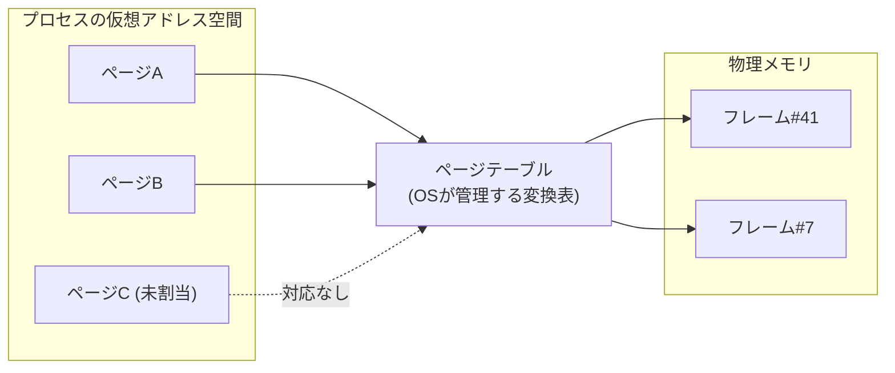

import RustPlay from '@components/RustPlay.astro';
import tlb from '@snippets/ch14/tlb.rs?raw';
import fault from '@snippets/ch14/fault.rs?raw';

この章でわかること:

- プログラムが見るアドレスが仮想アドレスであること。ページテーブルによる変換の仕組み
- TLB(アドレス変換のキャッシュ)と、そのミスのコスト(実測で1.9倍)
- メモリの確保と物理メモリの使用が別の事象であること
  (デマンドページング。実測で初回アクセスは220倍遅い)
- hugepages、コピーオンライト、mmapの位置づけ
- なぜ体系に必須か: [2章](/cpu/02-memory-hierarchy/)のキャッシュ階層は、
  アドレス変換というもう1つの階層を前提にしています。
  この章を省くと「メモリアクセスのコスト」の全体像が不完全になります

## メモリのアドレスは2種類ある

これまで「メモリのアドレス」と呼んできたもの(Rustの参照や
ポインタの値)は、プログラムが見る**仮想アドレス**(virtual address)であり、
物理的なDRAM上の位置ではありません。CPUとOSが分担して、
アクセスのたびに**物理アドレス**(physical address)へ変換しています。この仕組み全体を
**仮想メモリ**(virtual memory)と呼びます。

この変換を行う理由は主に3つです。

- **隔離**: プロセスごとに別の変換表を持たせれば、他のプロセスの
  メモリは対応するアドレスが存在しないため、原理的にアクセスできません
- **連続した空間の提供**: 物理メモリが断片化していても、仮想空間では
  連続した巨大な配列を確保できます。`Vec`が連続したメモリを
  前提にできるのは、この仕組みのためでもあります
- **実体の遅延と共有**: 後述のとおり、確保しただけのメモリに
  物理メモリを割り当てない、同じ物理メモリを複数プロセスで共有する、
  といった操作が可能になります

変換は**ページ**(page)という固定長の単位で行います。
主流のページサイズは4KBです(Apple Siliconは16KB)。
次の図が変換の全体像です。

## ページテーブルとページウォーク

変換表である**ページテーブル**(page table)は、OSがメモリ上に
作るデータ構造で、CPU内の**MMU**(memory management unit)が
参照します。

64ビットの仮想空間は広大なので、表は1枚ではなく多段の木構造に
なっています。x86-64では一般的に4段です(より広い空間を使う
5段拡張を持つCPUもあります)。つまり1回のアドレス変換は、
最悪の場合**メモリ読み出し4回**(各段の表を1回ずつたどる)を
意味します。これを**ページウォーク**(page walk)と呼びます。

2章の数値で考えると、このコストは大きすぎます。1回のロードのたびに
4回の追加メモリアクセスが発生すれば、性能は数分の1になります。
そのため、CPUはアドレス変換にもキャッシュを置いています。

## TLB: アドレス変換のキャッシュ

**TLB**(translation lookaside buffer)は、最近使った
「仮想ページ→物理フレーム」の変換結果を保持する、
MMU専用のキャッシュです。規模の目安は次のとおりです(おおよそ)。

- L1 TLBは数十〜百数十エントリです
- L2 TLBは1500〜3000エントリ程度です

この規模から、TLBが一度に変換を保持できるメモリ範囲を計算できます。
3000エントリ × 4KBページ = **約12MB**です。つまりTLBが対応できる範囲は
10MB強しかなく、L3キャッシュより狭いことになります。
データはキャッシュにあるのに変換がTLBにない、という状況は
珍しくありません。

実験で確かめます。256MBの領域に対して、同じ回数だけアクセスします。
(1)は64バイトおきのアクセスです(毎回別のキャッシュラインですが、
ページは64回に1回しか変わりません)。(2)は約4KBおきのアクセスです
(毎回別のライン、**かつ**毎回別のページ)。

<RustPlay code={tlb} mode="release" title="ラインを跨ぐだけ vs ページも跨ぐ" />

筆者の実測(Playground)では、64バイトおきが約14ミリ秒、
4KBおきが約27ミリ秒でした。**アクセスするキャッシュラインの数は
同じなのに、ページを毎回跨ぐと1.9倍**になりました。増加分の主因は
TLBミスとページウォークのコストです(厳密には、ストライドが
広がるとハードウェアプリフェッチの動作も変わるため、
その影響も含まれています。切り分けたい場合はLinuxの
`perf stat -e dTLB-load-misses`でTLBミス数を直接数えられます)。

対策は2章と同じく**局所性**です。データを小さく、
近くにまとめることは、キャッシュだけでなくTLBにも効果があります。
もう1つの対策として、ページ自体を大きくする方法があります。

## hugepages: ページを大きくする

多くのCPUは4KBのほかに**2MB**や**1GB**のページ(**hugepages**)を
サポートしています。仮に3000エントリを2MBページに使えれば約6GBに
対応できる計算です(大ページ用のTLB構成はCPUごとに異なるため、
実際の値はもっと小さくなることもあります)。大量のメモリを
走査するデータベースや科学計算では定番の設定です。

Linuxには、条件を満たしたメモリ領域を自動で2MBページに
まとめる**THP**(transparent huge pages)という仕組みがあり、
Rustプログラムも設定なしで効果を得ることがあります。
明示的に制御したい場合は`madvise`システムコールや
hugepage対応アロケータを使いますが、断片化やレイテンシの
ばらつきという副作用もあるため、効果は計測で確認します。

## 確保しても物理メモリは割り当てられない: デマンドページング

仮想メモリの性質のうち、性能への影響が最も大きいものを説明します。
新しく確保した大きな領域に対して、OSはページテーブルに、有効だが
物理フレーム未割り当て、と記録するだけで、**この時点では物理メモリを
ほぼ消費しません**。実際に物理フレーム(物理メモリのページ)を
割り当てるのは**最初にアクセスされた時点**です。これを**デマンドページング**
(demand paging)と呼びます(正確には、Linuxでは読み出しだけなら
共有のゼロページが対応付けられ、書き込みの時点で固有のフレームが
割り当てられます。また、アロケータが再利用する既存領域には
当てはまりません)。

物理フレームが未割り当てのページへのアクセスはCPUの例外として
検出され、OSが物理フレームを割り当ててから再実行されます。
この一連の処理が**ページフォールト**(page fault)です
(ディスクからの読み込みを伴わない軽量なものをminor fault、
伴うものをmajor faultと呼びます)。

実験で確かめます。出力される4つの時間に注目してください。

<RustPlay code={fault} mode="release" title="確保・初回アクセス・2回目アクセスの実測" />

筆者の実測(Playground)は次のとおりです。

- `vec![0u8; 128MB]`の確保は**約6マイクロ秒**でした。128MBの
  物理メモリを6µsで用意することはできません。OSはゼロのページを
  後で用意すると記録しただけです(ゼロ初期化の`Vec`はこの最適化を
  利用できるよう、`calloc`相当の経路を使います)
- `vec![1u8; 128MB]`の確保は**約75ミリ秒**でした。1で埋めるには
  全ページに実際に書く必要があり、その時点で物理メモリが割り当てられます
- ゼロ初期化バッファへの1回目の書き込み(4KiBおき)は**約73ミリ秒**
  でした。32,768ページ分のページフォールトのコストです
  (Playgroundのページは4KiB)
- 同じ場所への2回目の書き込みは**約0.3ミリ秒**で、1回目との差は
  **220倍**です。これが物理メモリ割り当て済みの領域の本来の速度です

実務で注意すべき点を3つ挙げます。

- **起動直後は遅くなります**。サーバの最初の数リクエストが遅い原因の
  1つです(ほかにキャッシュとJITのウォームアップがあります)
- **ベンチマークのウォームアップ**([8章](/rust-opt/08-measure/))には
  ページフォールトの償却も含まれています。criterionが最初の数回を
  捨てるのは正しい設計です
- OSが報告するメモリ使用量に仮想サイズと実使用量(RSS)の
  2つがあるのは、この区別のためです。また、`drop`で解放しても
  アロケータがOSに返すとは限らず、RSSはすぐには減りません

## コピーオンライトとmmap

デマンドページングと同じ考え方に基づく仕組みを2つ紹介します。

**コピーオンライト**(copy-on-write、COW)は、共有しておいて
書き込まれた時点で初めて複製する技法です。Unixの`fork`が
高速なのは、親子プロセスが物理メモリを共有し、書いたページだけ
複製されるからです。Rust標準ライブラリの`Cow`型や
`Arc::make_mut`は、同じ考え方をユーザー空間のデータ構造に
適用したものと言えます。

**mmap**(memory map)は、ファイルを仮想アドレス空間に対応付ける
システムコールです。読んだページだけがディスクから読み込まれるという
デマンドページングの応用で、巨大ファイルの一部だけにアクセスする
用途に向きます。通常のread系I/Oとの使い分けは
[27章](/systems/27-os-layer/)で実測します。

## まとめ

- プログラムが見るアドレスは仮想アドレスで、ページ(4KB等)単位の
  変換表(ページテーブル)で物理アドレスに変換されます
- 変換のキャッシュがTLBです。対応できる範囲は4KBページで10MB程度と狭く、
  ページを毎回跨ぐアクセスは実測で1.9倍遅くなりました。
  対策は局所性とhugepagesです
- メモリの確保では物理メモリは割り当てられず、初回アクセス時の
  ページフォールトで割り当てられます(実測: 初回は220倍遅い)
- COWとmmapは、遅延と共有という仮想メモリの設計方針の応用です

次章はキャッシュに戻り、その内部構造(結合性、セット競合)と
キャッシュブロッキングという技法を扱います。
特定のストライドのときだけ極端に遅くなるという、
2章では説明できなかった現象を説明します。
