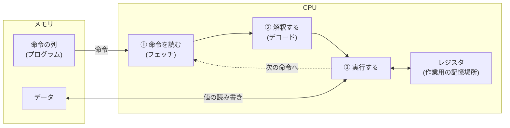

import RustPlay from '@components/RustPlay.astro';
import cpuSpeed from '@snippets/ch01/cpu-speed.rs?raw';

この章でわかること:

- Rustのコードが機械語に変換され、CPUで実行されるまでの流れ
- レジスタとは何か。CPUが命令を実行する基本サイクル
- CPUの計算がどれくらい速いか(実測)
- コンパイラが生成した機械語を自分の目で確認する方法

## CPUは何をする機械か

**CPU**(central processing unit)は、突き詰めると単純な機械です。
**メモリ**(memory)に置かれた**命令**(instruction)を順に読み取って実行する、
という動作をひたすら繰り返しています。

命令とは「この数とこの数を足す」「メモリのこの場所から値を読む」といった、
ごく小さな操作の指示です。命令は`0`と`1`の並びで表現され、
この形式を**機械語**(machine code)と呼びます。
プログラムとは機械語の命令の列であり、データと同じようにメモリに置かれます。



この図のサイクルを、現代のCPUは1秒間に数十億回まわしています。
本書のPart Iは、この単純なサイクルが「どう速くされているか」を
一段ずつ見ていく構成になっています。

## Rustのコードが機械語になるまで

Rustのソースコードは、コンパイラ(`rustc`)によって機械語に変換されます。
`cargo build`で得られる実行ファイルの中身は、ほぼ機械語の命令列です。

機械語は数値の並びで人間には読みにくいため、命令を1つずつ人間が読める
記法で書き直した**アセンブリ**(assembly)という表現を使います。
機械語とアセンブリは1対1に対応しており、「機械語を読む」ことは
実質「アセンブリを読む」ことだと考えて問題ありません。

次の関数がどんな機械語になるか見てみます。

```rust
pub fn add(a: i32, b: i32) -> i32 {
    a + b
}
```

x86-64(IntelやAMDのCPU)向けにコンパイルすると、アセンブリはこうなります。

```asm
add:
	lea	eax, [rdi + rsi]
	ret
```

たった2命令です。1行ずつ読みます。

- `lea eax, [rdi + rsi]` — レジスタ`rdi`と`rsi`の値を足し、結果をレジスタ`eax`に入れる
- `ret` — 関数から戻る

引数`a`と`b`はレジスタ`rdi`と`rsi`に入って渡され、
戻り値はレジスタ`eax`に入れて返す約束になっています。
この約束は**呼び出し規約**(calling convention)と呼ばれ、
ここではmacOSやLinuxのx86-64での規約(System V)で説明しています
(Windowsは別のレジスタを使います)。
いずれにせよ、Rustの`a + b`はCPUのたった1つの加算命令に対応しています。

同じ関数をARM64(Apple SiliconやスマートフォンのCPU)向けに
コンパイルすると、こうなります。

```asm
add:
	add	w0, w1, w0
	ret
```

命令の書き方は違いますが、「レジスタ2つを足して結果をレジスタに置き、戻る」
という構造は同じです。CPUが受け付ける命令の種類と形式のことを
**命令セット**(instruction set architecture、ISA)と呼び、
x86-64やARM64はその代表です。コンパイラは同じRustコードから、
命令セットごとに異なる機械語を生成します。

:::note[lea が加算に使われる理由]
`lea`は本来アドレス計算用の命令ですが、「2つのレジスタの和を
別のレジスタに書ける」ため、x86-64ではただの加算にもよく使われます。
アセンブリを読むと、このような命令の流用がたびたび出てきます。
:::

## レジスタ — CPUの手元にある記憶場所

先ほどから出ている**レジスタ**(register)は、CPU内部にある少数の
高速な記憶場所です。例えば、机の上に置ける数枚のメモ用紙のようなものです。
枚数は少ないものの、手を伸ばさず一瞬で読み書きできます。

- x86-64には64ビット幅の汎用レジスタが16本あります(`rax`、`rdi`、`rsi`など。
  `eax`は`rax`の下位32ビットを指す別名です)
- ARM64には31本あります(`x0`〜`x30`。`w0`は`x0`の下位32ビット)

CPUの計算命令は、主にレジスタ(または命令に埋め込まれた定数)を対象にします。
ARM64ではメモリ上のデータを計算に使うには必ずロード命令でレジスタに
読み込む必要があります。x86-64にはメモリ上の値を直接足せる命令もありますが、
その場合も内部ではロードしてから計算しています。

だからコンパイラは、よく使う変数をできるだけレジスタに割り当てようとします。
Rustのコードで`let x = ...`と書いても、`x`がメモリに置かれるとは限りません。
多くの場合、`x`はレジスタ上だけで生きて消えます。
この「変数をどのレジスタに割り当てるか」の決定は**レジスタ割り付け**
(register allocation)と呼ばれ、コンパイラの重要な仕事の1つです。

## 命令サイクルとクロック

CPUが1つの命令を処理する流れは、大きく3段階に分けられます。

1. **フェッチ**(fetch) — メモリから次の命令を読み取る
2. **デコード**(decode) — 命令の種類と対象(どのレジスタか等)を解釈する
3. **実行**(execute) — 計算やメモリアクセスを行い、結果をレジスタなどに書き戻す

この流れを刻むテンポが**クロック周波数**(clock frequency)です。
例えば3GHzのCPUは、1秒間に30億回の「拍」を刻みます。
1拍(1サイクル)は約0.33ナノ秒です。整数の加算のような単純な命令は、
おおよそ1サイクルで実行できます。

## 実験: CPUの速さを体感する

理屈はここまでにして、実際に測ってみます。
次のコードは1億回の加算を行い、かかった時間を表示します。
コード中の`wrapping_add`は「あふれたら2^64で回り込む足し算」です。
通常の`+`はdebugビルドではあふれをエラーにする検査が入るため、
「回り込んでよい」と明示して、後で行う2つのビルドの比較条件を揃えています。
「▶ 実行」を押してください(Rust Playground上で実行されます)。

<RustPlay code={cpuSpeed} title="1億回の加算(最適化なし: debugビルド)" />

Playground上では1秒弱、毎秒1億回強のペースで実行されるはずです
(共有環境なので、実行のたびに値はばらつきます)。

ここで疑問が生まれます。3GHz級のCPUなら1秒に30億サイクルあるのに、
なぜ毎秒1億回程度しか加算できないのでしょうか。

答えは、これが**debugビルド**(最適化なしのコンパイル)だからです。
debugビルドでは、コンパイラは変数`sum`や`i`を律儀にメモリ上に置き、
ループのたびに読み書きします。1回の加算のために、
実際には数十個の命令が実行されているのです。

では、最適化を有効にした**releaseビルド**で同じコードを実行してみます。

<RustPlay code={cpuSpeed} mode="release" title="同じコード(最適化あり: releaseビルド)" />

経過時間は数百ナノ秒程度、「毎秒数千兆回の加算」という
物理的にありえない数字が表示されたはずです。

種明かしをすると、コンパイラはこのループを見て
「`0`から`n-1`までの総和は公式で計算できる」と判断し、
**ループそのものを削除して**、数回の掛け算と足し算に置き換えました。
1億回の加算は、実行時には一度も行われていません。

この実験から、本書全体を貫く2つの事実がわかります。

- **性能の話はreleaseビルドが前提。** debugビルドの実行時間には意味がありません
- **コンパイラは、書いたとおりに翻訳する装置ではありません。**
  意味を保ったまま、コードを大胆に書き換えます。その仕組みは
  [6章 コンパイラがしていること](/rust-opt/06-compiler/)で扱います

## 生成された機械語を自分で確認するには

コンパイラが何をしたかは、推測ではなく生成されたアセンブリで確認できます。
手軽な方法を2つ挙げます。

- [Compiler Explorer](https://godbolt.org/) — ブラウザ上でコードを書くと、
  生成されるアセンブリが即座に表示されるサイトです。言語にRustを選び、
  コンパイラオプションに`-O`(最適化あり)を指定して使います
- `cargo asm` — 手元のプロジェクトの関数のアセンブリを表示する
  cargoサブコマンドです([8章](/rust-opt/08-measure/)で導入します)

本書でも「本当にそうなっているか」をアセンブリで確認する場面が
たびたび出てきます。

## まとめ

- CPUは「メモリから命令をフェッチ→デコード→実行」を繰り返す機械です
- プログラムは機械語の命令列としてメモリに置かれます。
  アセンブリは機械語の人間可読な表現です
- レジスタはCPU内部の少数・高速な記憶場所で、計算は原則レジスタ上で行われます
- 単純な加算は1命令・約1サイクル。3GHzのCPUは1秒に30億サイクル刻みます
- debugビルドとreleaseビルドの性能はまったく別物です。
  コンパイラはループを削除するほど大胆にコードを書き換えます

CPUは1秒に数十億回の計算ができます。しかし、計算対象のデータが
メモリから届かなければ、CPUはただ待つことになります。
実は現代のプログラムの速度を最も左右するのは、この「待ち」です。
次章では、メモリとキャッシュの仕組みを見ていきます。
