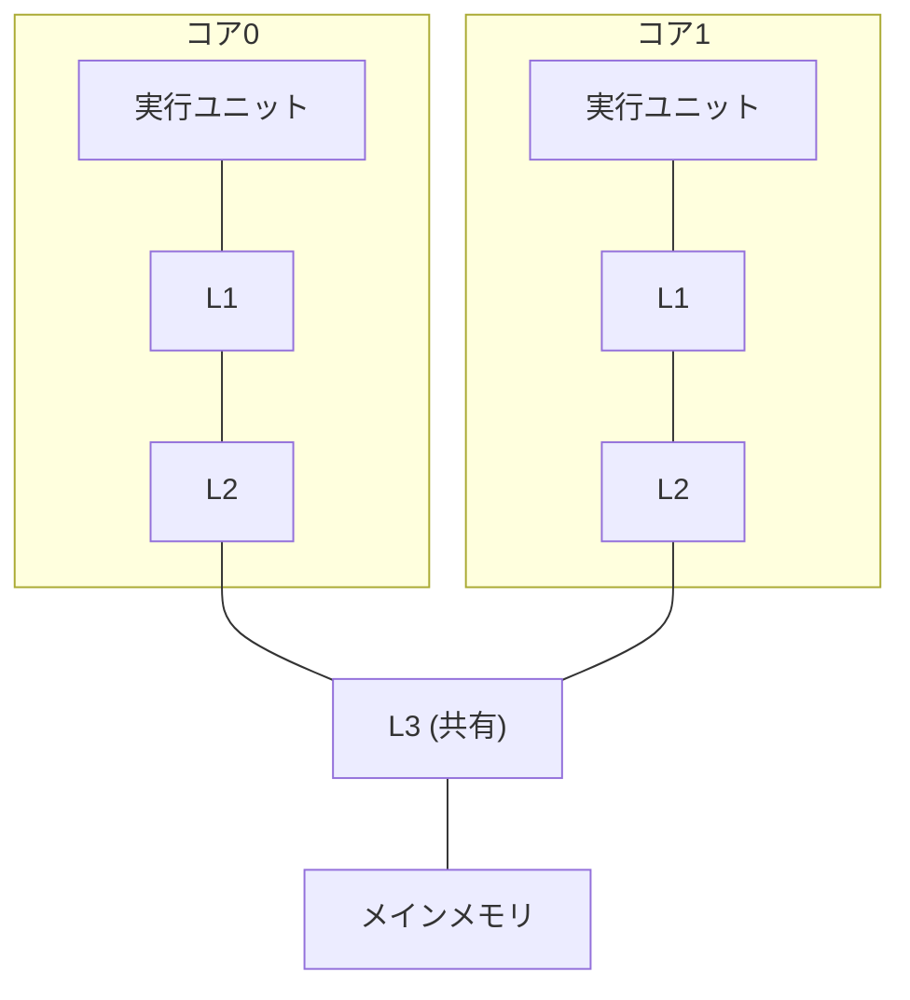

import RustPlay from '@components/RustPlay.astro';
import falseSharing from '@snippets/ch05/false-sharing.rs?raw';
import rayon from '@snippets/ch05/rayon.rs?raw';

この章でわかること:

- CPUにコアが複数ある理由と、コアごとのキャッシュの構成
- キャッシュコヒーレンスと、「共有していないのに遅くなる」false sharing
- データ競合と、Rustがそれをコンパイル時に防ぐ仕組みの要点
- アトミック操作とメモリオーダリングの入門
- Rayonによるデータ並列化と、並列化がスケールしない3つの要因

## コアが増えた理由

2000年代半ばまで、CPUはクロック周波数の向上で速くなり続けました。
しかし周波数を上げるほど消費電力と発熱が急増し、
1つの処理装置を高速化する方針は限界に達しました。
そのため、同じ処理装置を複数並べる方針に変わりました。

この処理装置の1つずつを**コア**(core)と呼びます。
各コアは1章〜4章で見た仕組み(パイプライン、キャッシュ、SIMD)を
それぞれ独立に持っていて、別々のプログラムを同時に実行できます。
現代のCPUは、ノートPCで数個〜十数個、サーバでは百個超のコアを持ちます。

なお、1つのコアに2つの命令の流れを混在させる**SMT**
(simultaneous multithreading、Intelの呼び名はHyper-Threading)という
技術もあり、OSからは「論理コア」が物理コアより多く見えることがあります。
Rustでは`std::thread::available_parallelism()`でこの値を取得できます。

ソフトウェア側の用語も整理しておきます。**スレッド**(thread)は
OSが管理する命令の流れの単位で、OSが各コアに割り当てます。
複数の処理を(1コアでも)交互に進める構造を**並行**(concurrency)、
複数のコアで文字どおり同時に実行することを**並列**(parallelism)と
呼び分けます。この章の主題は並列です。

## コアごとのキャッシュとコヒーレンス

2章のキャッシュ階層は、マルチコアでは例えば次の形になります。
L1・L2は各コア専用、L3は全コア共有という、
よくある構成の一例です(実際の段数や共有範囲はCPUごとに異なります)。

この構成では、同じメモリ上のデータの写しが、
複数のコアのL1に同時に存在できるという問題が生じます。
コア0が値を書き換えたのに、コア1が古い写しを読み続けたら、
プログラムは正しく動作しません。

これを防ぐハードウェアの仕組みが**キャッシュコヒーレンス**
(cache coherence)です。キャッシュライン単位で「共有中」「変更済み」
などの状態を管理し、あるコアがラインに書き込むときは、
他のコアが持つ同じラインの写しを無効化します(代表的な方式の
頭文字からMESIプロトコルと呼ばれます)。

プログラマの視点では、次の2点が要点です。
**読むだけなら写しは何枚あってもかまいません。書くには、そのラインの
排他的な所有権を得る必要があります。** 複数のコアが同じラインに
書き込み続けると、ラインの所有権がコア間を行き来し、
そのたびに数十サイクルの通信コストがかかります。

## 実験: 共有していないのに遅くなるfalse sharing

所有権の競合は、同じ変数に書き込むときだけでなく、
**同じキャッシュラインに載った別々の変数**に書き込むときにも起きます。

2つのスレッドが、それぞれ**自分専用の**カウンタを増やすだけの
実験です。2つのカウンタの置き場所(同じキャッシュラインか、
別のラインか)だけを変えて比べます。ラインの幅はCPUによって
64バイトまたは128バイトなので、実験では128バイト境界を使って
どちらのCPUでも意図どおりになるようにしています。

コードについて3点補足します。第一に、`#[repr(align(128))]`は
「この型を128バイト境界に置く」指定です。第二に、`thread::scope`は
「スコープを抜けるまでに中で作った全スレッドの終了を待つ」仕組みで、
この保証があるため、スタック上の変数への参照をスレッドに渡せます。
第三に、クロージャの`move`は、使う変数(ここでは参照)の所有権を
クロージャに移す指定です。

<RustPlay code={falseSharing} mode="release" title="自分専用のカウンタなのに、置き場所で速度が変わる" />

筆者の実測(Playground、2コア)では、同じラインに載せた配置が約670ミリ秒、
別のラインに離した配置が約270ミリ秒で、**2.5倍の差**がつきました。

隣接した2つの`AtomicU64`(8バイト×2)は同じキャッシュラインに載ります。
互いのカウンタにアクセスしていなくても、ライン単位で所有権が
行き来します。この現象を**false sharing**(偽共有)と呼びます。
論理的には何も共有していないのに、物理的な置き場所のせいで
共有コストが発生します。

対策は実験のとおり、頻繁に書く変数をスレッドごとに
別ラインへ離すことです。実験で使った`#[repr(align(128))]`のほか、
`crossbeam`クレートの`CachePadded`型がこの目的に使えます。

## データ競合とRustの保証

ここまでのカウンタに`AtomicU64`という型を使いました。
普通の`u64`を2つのスレッドから同期なしで書き換える状況は
**データ競合**(data race)と呼ばれ、C/C++では未定義動作、
つまり「何が起きてもおかしくない」状態です。不正な値が読めるだけでなく、
コンパイラの最適化の前提が成り立たなくなり、プログラム全体が不正になります。

Rustの特長は、`unsafe`を使わない範囲のコードについて、
データ競合を**コンパイル時に**排除することです。
所有権と借用の規則(可変参照`&mut`は同時に1つ)に加えて、
「スレッド間で移動してよい型」を表す`Send`、
「スレッド間で共有してよい型」を表す`Sync`というトレイトがあり、
条件を満たさない型をスレッドへ渡すコードはコンパイルに失敗します。
先ほどの実験で`AtomicU64`を使ったのは、まさに`u64`のままでは
コンパイラが拒否するからです。

正確に言うと、Rustが防ぐのは「データ競合」であり、処理のタイミングに
依存するバグ一般(競合状態)やデッドロックは対象外です。
それでも「コンパイルが通った並列コードにデータ競合はない」という保証は、
並列プログラミングの難易度を大きく下げます。

## アトミック操作とメモリオーダリング

**アトミック操作**(atomic operation)は、他のスレッドから
「途中の状態」が決して観測されない、分割不可能な読み書きのことで、
CPUの専用命令で実現されます。
`fetch_add`は「読んで、足して、書き戻す」を1つの不可分な操作として
実行するため、ロックなしでカウンタを共有できます。
複雑な共有状態には`Mutex`を使いますが、単一の数値やフラグなら
アトミック型のほうが軽量です。

アトミック操作の各メソッドには`Ordering`という引数がありました。
これは**メモリオーダリング**(memory ordering)、つまり
「この操作の前後で、他の読み書きの順序をどこまで保証するか」の指定です。
3章で見たとおりCPUは命令を並べ替えて実行し、コンパイラも
コードを並べ替えます。1スレッドの結果は変わらなくても、
**他のスレッドから見える順序**は変わりうるのです。

- `Relaxed`は、その変数の操作が不可分であることだけを保証します。
  実験のような単純なカウンタはこれで十分です
- `Acquire`/`Release`は、スレッド間の順序を保証します。例えばスレッドAが
  データを書いてから`ready`フラグを`Release`で真にし、スレッドBが
  `ready`を`Acquire`で読んで真だったとします。このときBには、フラグ以前の
  Aの書き込み(データ本体)もすべて見えることが保証されます。`Relaxed`には
  この保証がなく、「フラグは見えたがデータはまだ」がありえます
- `SeqCst`は、さらに、`SeqCst`同士の操作について、
  全スレッドで一致する1つの順序を保証します

正しい使い分けはそれ自体が1冊の本になる主題なので、
本書では「順序の保証には段階がある」ことを知るにとどめます。
詳しく学ぶ資料は[付録](/appendix/resources/)に挙げました。

## Rayonでデータ並列

低水準の話が続いたので、実用の並列化に進みます。
「大量の要素それぞれに独立な計算をする」形の処理
(**データ並列**、data parallelism)なら、
Rustでは`rayon`クレートで簡潔に並列化できます。

<RustPlay code={rayon} mode="release" title="イテレータをpar_iterに変えるだけ" />

変更点は`.into_par_iter()`の1箇所だけです。rayonはスレッドプールを
用意し、範囲を分割して各スレッドに配ります。処理を終えたスレッドは
他のスレッドの未処理分を引き取る(**ワークスティーリング**、
work stealing)ため、負荷が自然に均されます。

筆者の実測では、Playground(2コア共有)では354ミリ秒→214ミリ秒の約1.7倍、
手元の10コアのMac(Apple M4)では231ミリ秒→29ミリ秒の
**約8倍**になりました。コア数なりの効果が出ています。

適用の目安は2つあります。要素ごとの計算が十分重いことと、
要素間が独立であることです。計算が軽すぎると、
分配のオーバーヘッドが並列化の利益を上回ります。

なお、Webアプリケーションの文脈では役割分担に注意してください。
多数のリクエストを待ち受けて処理する「並行」はasyncランタイム(tokioなど)の
担当です。rayonが受け持つのは、1つの重い計算を複数コアで割る「並列」です。
リクエスト処理の中で重い計算をrayonに委ねる、という組み合わせはありえます。

## 並列化がスケールしない3つの要因

コアを2倍にしても2倍速くならないことは珍しくありません。
主要な要因は3つあります。

1. **逐次部分の存在**: プログラムの一部でも並列化できない部分が
   残ると、そこが上限を決めます。並列化できる割合が90%の場合、
   コアが無限にあっても最大10倍にしかなりません
   (**Amdahlの法則**、Amdahl's law)
2. **メモリ帯域の飽和**: 2章で見たとおり、単純な走査はメモリ律速です。
   コアを増やしても、メモリからデータを転送する帯域は共有なので
   頭打ちになります([12章](/gpu/12-cpu-vs-gpu/)で実測します)
3. **同期と通信**: ロックの競合、アトミック操作の連続、
   false sharingが該当します。いずれもコア間のライン移動という物理コストです

## まとめ

- 現代のCPUは同じ構造のコアを複数持ち、L1/L2はコア専用、L3は共有です
- キャッシュコヒーレンスにより、書き込みにはラインの排他的な所有権が
  必要になります。別々の変数でも同じラインに載っていれば遅くなります(false sharing)
- Rustはデータ競合になるコードをコンパイル時に拒否します
- 単純な共有カウンタやフラグにはアトミック型を使います。順序保証には段階があります
- データ並列にはrayonを使います。10コアの手元環境で8倍の実測が得られました
- スケールを制限するのは、逐次部分・メモリ帯域・同期コストの3つです

これでPart Iは終わりです。CPUの主要な仕組み(キャッシュ、
パイプライン、分岐予測、SIMD、マルチコア)を一通り見ました。
Part IIでは視点をコンパイラに移し、Rustコンパイラが
コードをどう機械語へ変換し、どんな最適化を施しているのかを扱います。
1章でループが消えた仕組みの全体像も、そこで説明します。
