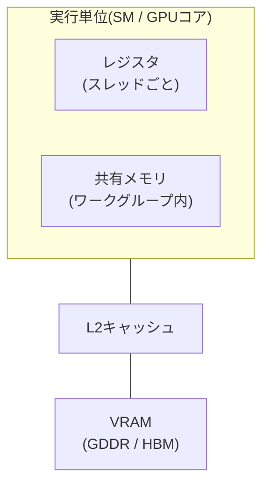

この章でわかること:

- GPUのメモリ階層(レジスタ、共有メモリ、VRAM)とCPUとの違い
- メモリコアレッシング — ワープ単位でのメモリアクセスの束ね方
- CPUとGPUの間のデータ転送コストと、ユニファイドメモリ
- 算術強度とルーフラインモデル — 「その処理はどこまで速くなれるか」を見積もる道具

## GPUのメモリ階層

GPUにもメモリの階層がありますが、CPUとは性格が異なります。
次の表と図に全体像を示します。

| 記憶場所 | 共有範囲 | 容量の目安 | 特徴 |
| --- | --- | --- | --- |
| レジスタ | スレッドごと | 数十KB/実行単位 | 常駐全スレッド分を物理保持(9章) |
| 共有メモリ | ワークグループ内 | 数十〜百KB/実行単位 | プログラマが明示的に使う |
| L2キャッシュ | GPU全体 | 数MB〜数十MB | 自動 |
| VRAM | GPU全体 | 数GB〜数十GB | 帯域数百GB/s〜、レイテンシ数百サイクル |



GPU専用のメモリである**VRAM**(video RAM)には、GDDRやHBMといった
広帯域のメモリが使われます。帯域はCPUのDRAMの数倍から数十倍
(数百GB/s〜数TB/s)ありますが、**レイテンシはCPUのDRAMと同等か、
それ以上に遅い**点が重要です。前章のとおり、GPUはレイテンシを
ワープの切り替えで隠す設計なので、メモリも帯域を最優先にしているのです。

## コアレッシング — ワープ単位の連続アクセス

2章で「メモリはキャッシュライン単位で運ばれるから、
連続アクセスが速い」と学びました。GPUには同じ原則の
ワープ版があります。

ワープの32スレッドは同じロード命令を同時に実行します。
このとき32個のアドレスが**隣接していれば**、ハードウェアは
それらを少数のまとまった転送に束ねます。これを
**メモリコアレッシング**(memory coalescing、合流)と呼びます。
アドレスがばらばらだと、転送は束ねられず何倍にも増えます。

つまりGPUで速いアクセスパターンは
「**隣のスレッドが、隣のデータを読む**」形です。
スレッド`i`が`data[i]`を読むのが理想で、
スレッド`i`が`data[i * stride]`を読む形は遅くなります。

2章のSoA(struct of arrays)がここで決定的に効きます。
AoSでは「全スレッドが同じフィールドを読む」とき、アドレスが
構造体サイズだけ飛び飛びになります。SoAならフィールドごとに
連続配列なので、完全にコアレッシングされます。
GPU向けのデータ設計でSoAが基本とされるのはこのためです。

## 共有メモリ — プログラマが管理するキャッシュ

前章の表にあった**共有メモリ**(shared memory、WGSLでは
workgroup memory)は、ワークグループ内のスレッドだけが見える
小さくて速いメモリです。CPUのL1キャッシュに近い速度ですが、
決定的な違いがあります。CPUのキャッシュはハードウェアが
自動で管理するのに対し、**共有メモリはプログラマが明示的に
読み書きする**ことです。

構文は11章で導入するWGSLのものですが先取りすると、
`var<workgroup>`で宣言し、「VRAMから共有メモリにタイルを載せる →
グループ内で何度も使い回す → 次のタイルへ」という使い方をします。
グループ内の全スレッドの足並みを揃えるには**バリア**
(`workgroupBarrier()`。全員がこの行に到達するまで待つ同期点)を
挟みます。バリアは全スレッドが必ず通る場所に置く必要があり、
`if`の片側にだけ書くことはできません。
[12章](/gpu/12-cpu-vs-gpu/)の行列積で実物を見ます。

## CPUとGPUの間 — 転送というボトルネック

ここまでのメモリはGPUの内側の話でした。しかしデータは元々
CPU側のメインメモリにあります。**CPUとGPUの間の転送**が、
GPU利用の最大の制約要因です。

一般的なPCでは、GPUはPCIeというバスでCPUと接続されています。
PCIe 4.0 x16の帯域は約32GB/s。VRAM内部の数百GB/sと比べて
1桁以上細い通り道です。データを送って、計算して、結果を戻す——
この往復の転送時間は、GPUで短縮した計算時間を上回ってしまう
ことが珍しくありません。次章の実測では、100万要素のベクトル加算が
CPUの15倍遅い、という結果を見ることになります。

一方、Apple SiliconやゲームコンソールのようにCPUとGPUが
**同じメモリを共有する**構成もあり、**ユニファイドメモリ**
(unified memory)と呼ばれます。この構成ではPCIeを渡る物理的な
コピーを省けます(ただしAPI上のバッファ間コピーや同期が
すべて消えるわけではありません)。代わりに、メモリ帯域を
CPUとGPUで分け合うことになります。

どちらの構成でも設計指針は同じです。

- 転送の回数と量を最小にする
- 一度GPUに置いたデータには、複数の処理を連続して適用する
  (毎回CPUに戻さない)
- 「計算だけGPUに投げれば速くなる」は転送を忘れた誤解

## 算術強度とルーフライン

「この処理はGPUで速くなるか」を、実装前に見積もる道具があります。

まず単位を1つ導入します。**FLOP**(floating-point operation)は
浮動小数点演算1回のことで、毎秒10億回をGFLOP/s、
毎秒1兆回をTFLOP/sと書きます。

そのうえで、処理の**算術強度**(arithmetic intensity)を、
「演算の回数 ÷ メモリとやり取りするバイト数」(FLOP/byte)と定義します。

- **ベクトル加算** `c[i] = a[i] + b[i]` — 要素あたり1演算に対し、
  読み8バイト+書き4バイト。算術強度は 1/12 ≈ 0.08 FLOP/byte
- **行列積**(n×n) — 出力n²個のそれぞれにn回の乗算と加算があるため
  演算は2n³回。データはn²個の行列3枚です。
  データを何度も使い回すため、理想的には算術強度はnに比例して
  大きくなります

この値と、ハードウェアの「演算ピーク性能」「メモリ帯域」を
1枚のグラフにしたのが**ルーフラインモデル**(roofline model)です。
次の図がその模式図です。

<figure class="book-figure">
  <svg viewBox="0 0 640 260" role="img" aria-label="ルーフラインモデルの図">
    <style>{`
      .ax { stroke: var(--sl-color-gray-3); stroke-width: 1.5; }
      .roof { stroke: var(--sl-color-accent); stroke-width: 2.5; fill: none; }
      .lbl { fill: var(--sl-color-gray-3); font-size: 12px; }
      .lbl-strong { fill: var(--sl-color-white); font-size: 12px; }
      .pt { fill: var(--sl-color-orange, #e0af68); }
      .guide { stroke: var(--sl-color-gray-5); stroke-dasharray: 4 4; }
    `}</style>
    <line x1="60" y1="220" x2="620" y2="220" class="ax" />
    <line x1="60" y1="220" x2="60" y2="20" class="ax" />
    <text x="240" y="248" class="lbl">算術強度 (FLOP/byte、対数軸) →</text>
    <text x="14" y="130" class="lbl" transform="rotate(-90 20 130)">性能 (GFLOP/s、対数軸) →</text>
    <polyline points="60,200 340,60 620,60" class="roof" />
    <text x="150" y="115" class="lbl-strong" transform="rotate(-26 150 115)">メモリ帯域の屋根</text>
    <text x="430" y="50" class="lbl-strong">演算ピークの屋根</text>
    <circle cx="130" cy="165" r="6" class="pt" />
    <line x1="130" y1="165" x2="130" y2="220" class="guide" />
    <text x="90" y="150" class="lbl">ベクトル加算</text>
    <circle cx="480" cy="60" r="6" class="pt" />
    <line x1="480" y1="60" x2="480" y2="220" class="guide" />
    <text x="440" y="90" class="lbl">大きな行列積</text>
  </svg>
  <figcaption>
    ルーフラインモデル。処理の算術強度が、到達できる性能の上限を決める
  </figcaption>
</figure>

グラフの「屋根」は2枚あります。算術強度が低い処理は左の斜面
——**メモリ帯域律速**(memory-bound)——の下にいて、
どれだけ演算ユニットがあっても帯域以上には速くなれません。
算術強度が高い処理だけが右の平ら——**演算律速**(compute-bound)——に
到達し、GPUの演算能力を使い切れます。

ベクトル加算のような算術強度0.1以下の処理は、GPUに持ち込んでも
帯域の上限に当たるだけです。行列積のように、データを何度も
使い回す(=算術強度が高い)処理こそがGPUの得意領域です。
そして12章では、**同じ行列積でもカーネルの書き方しだいで
「演算とメモリアクセスの比率」が変わり、性能が変わる**ことを実測します。

## 手を動かす: 算術強度の違いを観察する

手元にリポジトリがあれば、12章の行列積プログラムで
この章の概念を先に観察できます。

```sh
cd examples
cargo run --release -p ch12-matmul -- 512
```

出力のGFLOP/s(素朴なCPU版〜GPU版)を見比べてください。
同じ2n³回の演算でも、メモリの使い方によって
実効性能が2桁変わることがわかります。読み解き方は12章で説明します。

## まとめ

- GPUのメモリは帯域優先の設計です。レイテンシはワープ切り替えで隠します
- ワープ内の隣接スレッドが隣接アドレスを読むとき、アクセスは
  束ねられます(コアレッシング)。SoAはGPUの基本形です
- 共有メモリは「手動のキャッシュ」。バリアで同期しながら使います
- CPU-GPU間の転送は細い(PCIe)。転送回数の最小化が設計の要です。
  ユニファイドメモリでは転送が消える代わりに帯域を共有します
- 算術強度とルーフラインで「速くなれる上限」を実装前に見積もれます

概念の準備は整いました。次章では、Rustからwgpuを使って
実際にGPUでコードを動かします。
