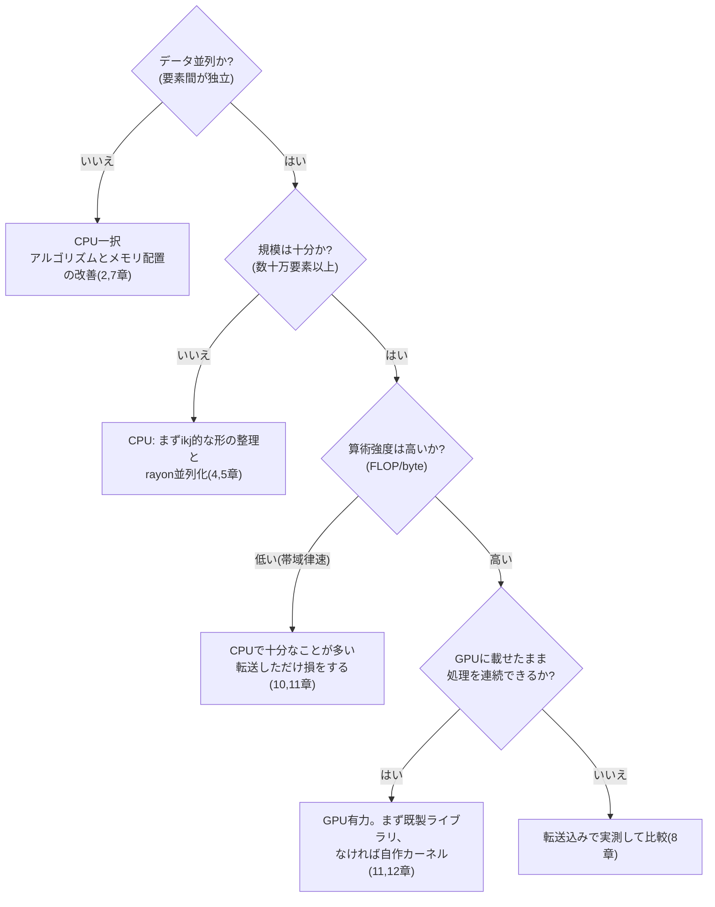

この章でわかること:

- 同じ行列積が、書き方だけで77倍変わる過程(実測)
- CPU側の最適化: ループ順の入れ替えと並列化
- GPU側の最適化: 素朴なカーネルから算術強度を上げるまで
- 「CPUとGPUのどちらを使うか」の判断基準

この章の実験はリポジトリの`examples/ch12-matmul`で、
すべて手元で再現できます。

```sh
cd examples
cargo run --release -p ch12-matmul        # n=1024
cargo run --release -p ch12-matmul -- 2048
```

計測環境は筆者のMac(Apple M4、CPU 10コア、GPU 10コア、
ユニファイドメモリ)です。倍率はハードウェアで変わりますが、
「何がなぜ効くか」の構造は共通です。

## 題材 — 行列積

n×n行列の積 C = A × B を`f32`で計算します。定義どおりに書けばこうです。

```rust
/// 素朴な3重ループ(ijk順)
fn matmul_naive(a: &[f32], b: &[f32], c: &mut [f32], n: usize) {
    for i in 0..n {
        for j in 0..n {
            let mut sum = 0.0;
            for k in 0..n {
                sum += a[i * n + k] * b[k * n + j];
            }
            c[i * n + j] = sum;
        }
    }
}
```

演算数は2n³。n=1024で約21億回の浮動小数点演算です。
データは3枚で12MB——演算がデータ量に対して圧倒的に多い、
算術強度の高い問題(10章)です。だからこそ、
機械学習の心臓部であり、最適化の古典的な題材でもあります。

n=1024の実測: **873ミリ秒(2.5 GFLOP/s)**。ここから始めます。

## CPU編 その1 — ループの順序を変えるだけで13倍

素朴版の問題は、最内ループの`b[k * n + j]`です。
`k`が増えるたびにアドレスが n×4バイト(4KB)ずつ飛びます。
2章で見た最悪のアクセスパターン——毎回別のキャッシュラインを
触り、しかもプリフェッチも効きにくい形です。

ループの入れ子の順序を ijk から **ikj** に入れ替えます。

```rust
/// ループ順を ikj に。すべてのアクセスが行方向(連続)になる
fn matmul_ikj(a: &[f32], b: &[f32], c: &mut [f32], n: usize) {
    c.fill(0.0);
    for i in 0..n {
        for k in 0..n {
            let aik = a[i * n + k];
            let b_row = &b[k * n..k * n + n];
            let c_row = &mut c[i * n..i * n + n];
            for j in 0..n {
                c_row[j] += aik * b_row[j];
            }
        }
    }
}
```

計算の内容も回数もまったく同じです。しかし最内ループは
「連続した`b`の行を読み、連続した`c`の行に足し込む」形になりました。
キャッシュラインの全バイトが使われ(2章)、
依存のない連続アクセスなので自動ベクトル化も効きます(4章)。

実測: **67ミリ秒(32 GFLOP/s)。13倍速くなりました。**
アルゴリズムを変えず、メモリアクセスの順序を変えただけです。
本書で最も強調したい結果がこれです。

## CPU編 その2 — 並列化で さらに4.4倍

ikj版は行ごとに独立した計算なので、rayon(5章)で
行単位に並列化できます。`c.par_chunks_mut(n)`で`c`を行に割り、
各スレッドが自分の行だけを書きます(データ競合はコンパイル時に排除)。

実測: **16.2ミリ秒(132 GFLOP/s)**。10コアで約4倍です。
コア数どおりの10倍にならないのは、メモリ帯域の共有(5章の
スケーリング限界)に加え、コアの性能が均一でないためです
(Apple SiliconのCPUは高性能なPコアと省電力なEコアの混成です)。

素朴版から数えて54倍。CPU側はここまでにします
(さらにキャッシュブロッキングや明示的SIMDを重ねる余地はあります)。

## GPU編 その1 — 素朴なカーネル

同じ計算をGPUに持ち込みます。1スレッドがCの1要素を受け持つ、
最も素朴なWGSLカーネルです(骨格は11章と同じ)。

```wgsl
@compute @workgroup_size(16, 16)
fn matmul_naive(@builtin(global_invocation_id) gid: vec3<u32>) {
    let n = params.n;
    let row = gid.y;
    let col = gid.x;
    if (row >= n || col >= n) { return; }
    var sum = 0.0;
    for (var k = 0u; k < n; k = k + 1u) {
        sum = sum + a[row * n + k] * b[k * n + col];
    }
    c[row * n + col] = sum;
}
```

100万スレッドを起動します。実測(計算のみ、転送別):
**14.4ミリ秒(149 GFLOP/s)**。いきなりCPUの全コア版と同水準です。
9章で説明した大規模並列の効果が確かに出ています。

## GPU編 その2 — 共有メモリのタイル化(と、正直な結果)

GPU最適化の定番は、10章で説明した共有メモリの活用です。
ワークグループ(16×16)でAとBのタイルを共有メモリに載せ、
バリアで同期しながら使い回します。

```wgsl
var<workgroup> tile_a: array<f32, 256>;
var<workgroup> tile_b: array<f32, 256>;
// 各スレッドがタイルの1要素を運ぶ → workgroupBarrier() →
// タイル内16要素分の積和を共有メモリから読む → 次のタイルへ
```

実測: **15.9ミリ秒(135 GFLOP/s)——速くなりませんでした。**

教科書どおりなら効くはずの手が効かない。これも現実です。
考えられる理由はこのハードウェアとカーネルの組にあります。
M4はユニファイドメモリと比較的大きなキャッシュを持ち、素朴版の時点で
(コアレッシングされた`b`の読みとキャッシュに載った`a`の行で)
メモリ転送はさほど詰まっていないようです。だとすればボトルネックは
メモリ帯域ではなく、**1回の積和に対して2回のロード命令を発行している
という命令数の比率**にある——これはカーネル内部の計測をしていない
以上仮説ですが、次の実験がこの見立てを支持します。
いずれにせよ、ボトルネックでない場所を改善しても速くならない
(8章の教訓)のは GPU でも同じです。なお、キャッシュの小さい
外付けGPUでは、同じタイル化がはっきり効くのが定番です。
最適化はハードウェアに依存します。

## GPU編 その3 — 1スレッドあたりの演算比率を上げる

ボトルネックが「ロードあたりの演算数」なら、打ち手は
1スレッドにもっと多くの計算を持たせることです。
1スレッドがCの**4×4ブロック**を受け持つカーネルに変えます。

```wgsl
@compute @workgroup_size(8, 8)
fn matmul_blocked(@builtin(global_invocation_id) gid: vec3<u32>) {
    // 4×4個の積算値をレジスタに保持
    var acc: array<vec4<f32>, 4>;
    for (var k = 0u; k < n; k = k + 1u) {
        let vb = /* bの行から4要素 */;        // 4ロード
        for (var i = 0u; i < 4u; i = i + 1u) {
            let aik = a[(row0 + i) * n + k];  // 4ロード
            acc[i] = acc[i] + aik * vb;       // 16積和
        }
    }
    // acc を c に書き出す
}
```

1周あたりメモリ参照8回に対して積和16回——素朴版(2回の参照に
積和1回)と比べて、演算対ロードの比率が4倍になりました。
実測: **11.3ミリ秒(190 GFLOP/s)**。今度は効きました。
10章のルーフラインの考え方——何律速かを見極めてから打つ——が
GPUカーネルの中でもそのまま通用することがわかります。

なお、実用レベルの行列積カーネル(ベンダーのライブラリや専用実装)は、
タイル化・ブロック化・ベクトルロードを何段も重ねて、
このGPUなら数TFLOP/sまで到達します。自作カーネルは
その入り口に立ったところです。「行列積がしたいだけ」なら、
ライブラリ(Metal Performance Shaders、cuBLASなど)を使うのが
正解であることも申し添えておきます。

## 結果一覧

n=1024(計算のみ)の全記録です。

| 実装 | 時間 | GFLOP/s | 素朴版比 |
| --- | --- | --- | --- |
| CPU 素朴(ijk) | 873 ms | 2.5 | 1x |
| CPU ikj | 67 ms | 32 | 13x |
| CPU ikj + rayon(10コア) | 16.2 ms | 132 | 54x |
| GPU 素朴 | 14.4 ms | 149 | 61x |
| GPU タイル化 | 15.9 ms | 135 | 55x |
| GPU ブロック化 | 11.3 ms | 190 | **77x** |

n=2048でも構図は同じです(CPU並列117ms、GPUブロック化89ms)。
そして重要な注記が3つあります。

- GPUの数字に**初期化と転送を含めると**、n=1024のブロック化は
  約15ミリ秒になり、CPU並列版とほぼ並びます。単発の計算なら
  GPUの優位は消えるということです
- この「僅差」はユニファイドメモリのMacでの結果です。
  強力な外付けGPUなら計算自体が1桁速くなる一方、
  PCIe転送のコストも1桁重くなります。**構成しだいで答えは変わります**
- 計測の条件は完全に対称ではありません。GPUの時間は
  「ディスパッチ+完了待ち」の壁時計時間でカーネル単体より長めに出ますし、
  CPU側は各1回の計測です。厳密な比較にはGPU側のタイムスタンプ計測や
  複数回の統計(8章)が必要ですが、本書の目的は傾向の把握です

## 使い分けの判断

本書の全章を1枚にまとめると、判断はこう流れます。



そして、どの分岐でも変わらない3つの原則があります。

1. **比較は「最適化したCPU」と行う。** 素朴なCPUコードとGPUを
   比べれば77倍に見え、最適化したCPUと比べれば1.4倍でした。
   「GPUで100倍」という数字を見たら、CPU側がikjすら
   していない可能性を疑ってください
2. **速さの源泉はどちらも同じ。** 連続したメモリアクセス、
   高い並列度、揃った分岐、高い算術強度。CPUで学んだことは
   すべてGPUで通用し、逆もまた然りです
3. **最後は計測で決める。** この章の「タイル化が効かない」のような
   予想外は、実測でしか見つかりません

## まとめ

この章のまとめは、そのまま本書全体のまとめです。
12章分を通じて一貫して見てきたことを3行に圧縮します。

- 現代の計算の速さは、演算そのものではなく
  **メモリアクセスの形と並列度**でほぼ決まります
- Rustは、ゼロコスト抽象化と安全な並列性によって、
  この2つを妥協なく追求できる言語です
- 直感は外れます。**アセンブリと計測**という2つの手段で、
  実際に何が起きているかを確かめてください

基礎編はここまでです。ここまで読んだあなたは、
「なぜこのコードは速いのか」を仕組みで説明できるはずです。
言葉の確認には[用語集](/appendix/glossary/)をどうぞ。

この先には応用編(Part IV〜VII)が続きます。数の表現、仮想メモリ、
キャッシュの内部、アロケータ、async、GPUカーネルの技法——
基礎編で意図的に省いた「体系を閉じるための柱」を、
同じ流儀(実測と機構)で1本ずつ立てていきます。
[13章 数の表現](/cpu-deep/13-numbers/)からどうぞ。
