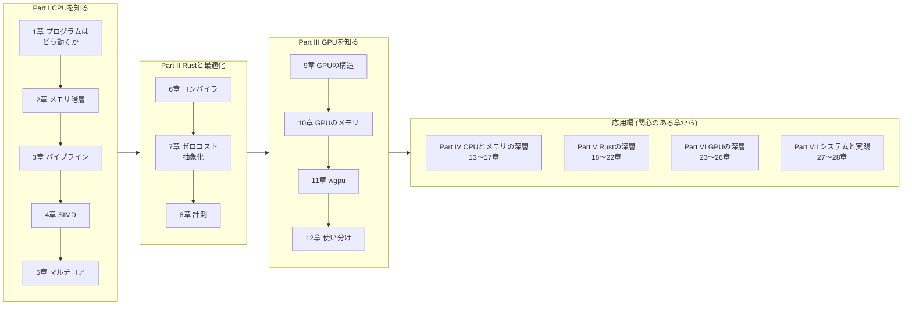

import RustPlay from '@components/RustPlay.astro';
import hello from '@snippets/intro/hello.rs?raw';

この本は、**Webアプリケーション開発者のための、CPUとGPUの教科書**です。
Rustのコードを入り口にして、コンピュータが実際にどう計算しているのかを、
ハードウェアの動きまで下りて理解することを目指します。

## 対象読者

次のような読者を想定しています。

- Webアプリケーションの開発経験はあるが、CPUやGPUの内部にはあまり詳しくない
- Rustの主要な概念（所有権、トレイト、ジェネリクスなど）は把握しているが、
  コンパイラが内部で何をしているかは知らない
- 「なぜこのコードは速いのか／遅いのか」を、雰囲気ではなく仕組みで説明できるようになりたい

Rustの文法そのものは解説しません。逆に、CPU・GPUについては前提知識ゼロから
説明します。専門用語は初出時に必ず説明し、巻末の[用語集](/appendix/glossary/)にもまとめてあります。

## この本で何がわかるか

読み終えると、次の質問に自分の言葉で答えられるようになります。

- CPUはプログラムをどうやって実行しているのか。キャッシュやパイプラインとは何か
- なぜ配列の走査は速く、連結リストの走査は遅いのか
- Rustコンパイラは、書いたコードをどんな機械語に変え、どう最適化しているのか
- 「ゼロコスト抽象化」はどこまで本当か。イテレータは本当にループと同じ速さなのか
- GPUはなぜ特定の計算だけ桁違いに速いのか。CPUとどう使い分けるべきか
- RustからGPUを動かすにはどうすればよいか

## 構成

次の図は本書の全体の流れです。基礎編の3つのPartを順にたどり、
その先の応用編(Part IV〜VII)は関心のある章から読めます。

本書は**基礎編**(Part I〜III)と**応用編**(Part IV〜VII)の2部構成です。

基礎編は、前提知識ゼロから最短経路で「仕組みで速度を説明できる」状態に
到達することを目指します。

- **Part I（CPUを知る）** — 機械語とレジスタから始めて、メモリ階層、パイプライン、
  SIMD、マルチコアまで、現代のCPUの主要な仕組みを一つずつ見ていきます
- **Part II（Rustと最適化）** — Part Iの知識を土台に、Rustコンパイラがコードを
  どう機械語に変換し、最適化しているかを確かめる方法を学びます
- **Part III（GPUを知る）** — CPUとの対比でGPUの設計を理解し、
  wgpuを使って実際にRustからGPUで計算します

応用編は、基礎編で意図的に省いた「体系を閉じるための柱」を扱います。
1つ1つは独立して読めますが、いずれも基礎編の理解を前提とします。

- **Part IV（CPUとメモリの深層）** — 数の表現、仮想メモリとTLB、
  キャッシュの内部構造、CPUフロントエンド、メモリモデルの実装
- **Part V（Rustの深層）** — アロケータ、asyncの実体、unsafeとUB、
  ビルドの制御、データ構造の実性能
- **Part VI（GPUの深層）** — カーネル最適化の体系、転送の隠蔽、
  行列エンジンと混合精度、GPUの計測
- **Part VII（システムと実践）** — OSの層のコスト、実務での性能工学、
  そして全体の知識地図

基礎編の各章は前の章の内容を前提にしているので、順に読むことを
おすすめします。応用編は関心のある章から読んでかまいません。

## コードをその場で実行できます

本文中のコードブロックの多くは、**ブラウザ上でそのまま実行できます**。
「▶ 実行」を押すと、Rust公式の実行環境（[Rust Playground](https://play.rust-lang.org/)）に
コードが送られ、コンパイルと実行の結果が表示されます。
「編集」を押せばコードを書き換えて試せます。

<RustPlay code={hello} />

GPUを使う章のコードはブラウザでは実行できないため、手元で動かすための
完全なプロジェクトをリポジトリの `examples/` ディレクトリに用意しています。

## 表記について

- 説明のための数値（キャッシュ容量、レイテンシなど）は、断りがない限り
  現代の一般的なCPU・GPUのおおよその値です。実際の値はハードウェアごとに異なります
- 「筆者の実測」とある値は、断りがなければRust Playground
  （共有のx86-64 Linux環境、stableのrustc、releaseビルド）での実測です。
  「手元のMac」とあるものはApple M4（CPU 10コア、GPU 10コア、
  ユニファイドメモリ）での実測です。共有環境の値は実行のたびにばらつきます
- コマンドの実行例は macOS / Linux のシェルを想定しています
- Rustのコードはエディション2024を前提としています

それでは、[1章 プログラムはどう動くか](/cpu/01-how-code-runs/)から始めましょう。
